<!-- GENERATED:MODEL -->
---
tags: [odoo, community, generated, model]
---

# sms.sms

- Module: [[docs/Community Addons/mass_mailing_sms/mass_mailing_sms|mass_mailing_sms]]
- Scope: Community Addons
- Defined in module: extension only
- Source files: `models/sms_sms.py`
- Python classes: `SmsSms`

## Field footprint

- Detected fields: 2
- Field types: `Many2one` x 1, `One2many` x 1
- Relation fields: 2

## Sample fields

- `mailing_id`: `Many2one` (comodel `mailing.mailing`)
- `mailing_trace_ids`: `One2many` (comodel `mailing.trace`)

## Method hints

- Detected methods: 1
- Action methods: none
- Compute methods: none
- Onchange methods: none

## Direct relation diagram

```plantuml
@startuml
!define ODOO_COLOR_PRIMARY #714B67
!define ODOO_COLOR_ACCENT #875A7B
!define ODOO_COLOR_BG #FAF7FA

skinparam backgroundColor ODOO_COLOR_BG
skinparam defaultTextAlignment left
skinparam ArrowColor ODOO_COLOR_ACCENT
skinparam ClassBackgroundColor white
skinparam ClassBorderColor ODOO_COLOR_PRIMARY
skinparam ComponentBackgroundColor white
skinparam ComponentBorderColor ODOO_COLOR_PRIMARY
skinparam NoteBackgroundColor #FFF8FF
skinparam NoteBorderColor ODOO_COLOR_ACCENT
skinparam SequenceLifeLineBorderColor ODOO_COLOR_ACCENT
skinparam SequenceLifeLineBackgroundColor #FFFFFF
skinparam SequenceParticipantBorderColor ODOO_COLOR_PRIMARY
skinparam SequenceParticipantBackgroundColor #FFFFFF
skinparam sequence {
  ArrowColor ODOO_COLOR_ACCENT
  ActorBorderColor ODOO_COLOR_PRIMARY
}
title sms.sms - Direct Relations
class "sms.sms" as sms_sms
class "mailing.mailing" as mailing_mailing
class "mailing.trace" as mailing_trace
sms_sms --> mailing_mailing : mailing_id
sms_sms --|> mailing_trace : mailing_trace_ids
@enduml
```

## Navigation

- **Parent:** [[docs/Community Addons/mass_mailing_sms/Models]]

<!-- GENERATED:MODEL -->
