<!-- GENERATED:MODEL -->
---
tags: [odoo, community, generated, model]
---

# utm.campaign

- Module: [[docs/Community Addons/mass_mailing_sms/mass_mailing_sms|mass_mailing_sms]]
- Scope: Community Addons
- Defined in module: extension only
- Source files: `models/utm.py`
- Python classes: `UtmCampaign`

## Field footprint

- Detected fields: 4
- Field types: `Integer` x 2, `One2many` x 1, `Selection` x 1
- Relation fields: 1

## Sample fields

- `ab_testing_mailings_sms_count`: `Integer` (comodel `A/B Test Mailings SMS #`, compute `_compute_mailing_sms_count`)
- `ab_testing_sms_winner_selection`: `Selection`
- `mailing_sms_count`: `Integer` (comodel `Number of Mass SMS`, compute `_compute_mailing_sms_count`)
- `mailing_sms_ids`: `One2many` (comodel `mailing.mailing`)

## Method hints

- Detected methods: 4
- Action methods: `action_create_mass_sms`, `action_redirect_to_mailing_sms`
- Compute methods: `_compute_mailing_sms_count`
- Onchange methods: none

## Direct relation diagram

```plantuml
@startuml
!define ODOO_COLOR_PRIMARY #714B67
!define ODOO_COLOR_ACCENT #875A7B
!define ODOO_COLOR_BG #FAF7FA

skinparam backgroundColor ODOO_COLOR_BG
skinparam defaultTextAlignment left
skinparam ArrowColor ODOO_COLOR_ACCENT
skinparam ClassBackgroundColor white
skinparam ClassBorderColor ODOO_COLOR_PRIMARY
skinparam ComponentBackgroundColor white
skinparam ComponentBorderColor ODOO_COLOR_PRIMARY
skinparam NoteBackgroundColor #FFF8FF
skinparam NoteBorderColor ODOO_COLOR_ACCENT
skinparam SequenceLifeLineBorderColor ODOO_COLOR_ACCENT
skinparam SequenceLifeLineBackgroundColor #FFFFFF
skinparam SequenceParticipantBorderColor ODOO_COLOR_PRIMARY
skinparam SequenceParticipantBackgroundColor #FFFFFF
skinparam sequence {
  ArrowColor ODOO_COLOR_ACCENT
  ActorBorderColor ODOO_COLOR_PRIMARY
}
title utm.campaign - Direct Relations
class "utm.campaign" as utm_campaign
class "mailing.mailing" as mailing_mailing
utm_campaign --|> mailing_mailing : mailing_sms_ids
@enduml
```

## Navigation

- **Parent:** [[docs/Community Addons/mass_mailing_sms/Models]]

<!-- GENERATED:MODEL -->
