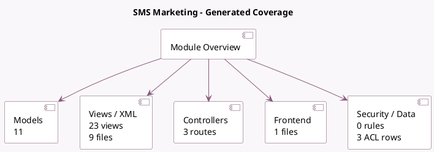

<!-- GENERATED:MODULE -->
---
tags: [odoo, community, module]
---

# SMS Marketing

- Scope: Community Addons
- Source: odoo/addons/mass_mailing_sms
- Dependencies: [[docs/Community Addons/portal/portal|portal]], [[docs/Community Addons/mass_mailing/mass_mailing|mass_mailing]], [[docs/Community Addons/sms/sms|sms]]

## Summary

Design, send and track SMS

## Generated coverage

- Models: 11
- XML files with UI/data artifacts: 9
- Views: 23
- Actions: 10
- Menus: 10
- Rules (ir.rule): 0
- Access CSV entries: 3
- Controller units: 1
- Frontend asset files: 1

## Module map

## Detail notes

- Models: [[docs/Community Addons/mass_mailing_sms/Models|Models]] (11)
- Views and XML: [[docs/Community Addons/mass_mailing_sms/Views|Views]] (9 files)
- Controllers: [[docs/Community Addons/mass_mailing_sms/Controllers|Controllers]] (1)
- Frontend: [[docs/Community Addons/mass_mailing_sms/Frontend|Frontend]] (1 files)

## Key models

- `mailing.contact`
- `mailing.list`
- `mailing.mailing`
- `mailing.sms.test`
- `mailing.trace`
- `res.users`
- `sms.composer`
- `sms.sms`
- `sms.tracker`
- `utm.campaign`
- `utm.medium`

## Navigation

- [[../Community Addons/Community Addons|Back to scope]]
- [[../../docs/docs|Back to docs]]

<!-- GENERATED:MODULE -->

