<!-- GENERATED:MODEL -->
---
tags: [odoo, community, generated, model]
---

# microsoft.calendar.account.reset

- Module: [[docs/Community Addons/microsoft_calendar/microsoft_calendar|microsoft_calendar]]
- Scope: Community Addons
- Defined in module: yes
- Source files: `wizard/reset_account.py`
- Python classes: `MicrosoftCalendarAccountReset`
- Description: Microsoft Calendar Account Reset

## Field footprint

- Detected fields: 3
- Field types: `Many2one` x 1, `Selection` x 2
- Relation fields: 1

## Sample fields

- `delete_policy`: `Selection`
- `sync_policy`: `Selection`
- `user_id`: `Many2one` (comodel `res.users`)

## Method hints

- Detected methods: 1
- Action methods: none
- Compute methods: none
- Onchange methods: none

## Direct relation diagram

```plantuml
@startuml
!define ODOO_COLOR_PRIMARY #714B67
!define ODOO_COLOR_ACCENT #875A7B
!define ODOO_COLOR_BG #FAF7FA

skinparam backgroundColor ODOO_COLOR_BG
skinparam defaultTextAlignment left
skinparam ArrowColor ODOO_COLOR_ACCENT
skinparam ClassBackgroundColor white
skinparam ClassBorderColor ODOO_COLOR_PRIMARY
skinparam ComponentBackgroundColor white
skinparam ComponentBorderColor ODOO_COLOR_PRIMARY
skinparam NoteBackgroundColor #FFF8FF
skinparam NoteBorderColor ODOO_COLOR_ACCENT
skinparam SequenceLifeLineBorderColor ODOO_COLOR_ACCENT
skinparam SequenceLifeLineBackgroundColor #FFFFFF
skinparam SequenceParticipantBorderColor ODOO_COLOR_PRIMARY
skinparam SequenceParticipantBackgroundColor #FFFFFF
skinparam sequence {
  ArrowColor ODOO_COLOR_ACCENT
  ActorBorderColor ODOO_COLOR_PRIMARY
}
title microsoft.calendar.account.reset - Direct Relations
class "microsoft.calendar.account.reset" as microsoft_calendar_account_reset
class "res.users" as res_users
microsoft_calendar_account_reset --> res_users : user_id
@enduml
```

## Navigation

- **Parent:** [[docs/Community Addons/microsoft_calendar/Models]]

<!-- GENERATED:MODEL -->
