<!-- GENERATED:MODEL -->
---
tags: [odoo, community, generated, model]
---

# change.production.qty

- Module: [[docs/Community Addons/mrp/mrp|mrp]]
- Scope: Community Addons
- Defined in module: yes
- Source files: `wizard/change_production_qty.py`
- Python classes: `ChangeProductionQty`
- Description: Change Production Qty

## Field footprint

- Detected fields: 2
- Field types: `Float` x 1, `Many2one` x 1
- Relation fields: 1

## Sample fields

- `mo_id`: `Many2one` (comodel `mrp.production`)
- `product_qty`: `Float` (comodel `Quantity To Produce`)

## Method hints

- Detected methods: 4
- Action methods: none
- Compute methods: none
- Onchange methods: none

## Direct relation diagram

```plantuml
@startuml
!define ODOO_COLOR_PRIMARY #714B67
!define ODOO_COLOR_ACCENT #875A7B
!define ODOO_COLOR_BG #FAF7FA

skinparam backgroundColor ODOO_COLOR_BG
skinparam defaultTextAlignment left
skinparam ArrowColor ODOO_COLOR_ACCENT
skinparam ClassBackgroundColor white
skinparam ClassBorderColor ODOO_COLOR_PRIMARY
skinparam ComponentBackgroundColor white
skinparam ComponentBorderColor ODOO_COLOR_PRIMARY
skinparam NoteBackgroundColor #FFF8FF
skinparam NoteBorderColor ODOO_COLOR_ACCENT
skinparam SequenceLifeLineBorderColor ODOO_COLOR_ACCENT
skinparam SequenceLifeLineBackgroundColor #FFFFFF
skinparam SequenceParticipantBorderColor ODOO_COLOR_PRIMARY
skinparam SequenceParticipantBackgroundColor #FFFFFF
skinparam sequence {
  ArrowColor ODOO_COLOR_ACCENT
  ActorBorderColor ODOO_COLOR_PRIMARY
}
title change.production.qty - Direct Relations
class "change.production.qty" as change_production_qty
class "mrp.production" as mrp_production
change_production_qty --> mrp_production : mo_id
@enduml
```

## Navigation

- **Parent:** [[docs/Community Addons/mrp/Models]]

<!-- GENERATED:MODEL -->
