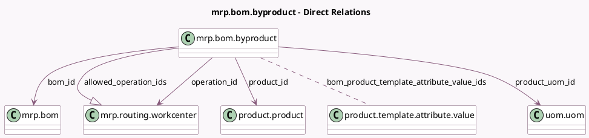

<!-- GENERATED:MODEL -->
---
tags: [odoo, community, generated, model]
---

# mrp.bom.byproduct

- Module: [[docs/Community Addons/mrp/mrp|mrp]]
- Scope: Community Addons
- Defined in module: yes
- Source files: `models/mrp_bom.py`
- Python classes: `MrpBomByproduct`
- Description: Byproduct

## Field footprint

- Detected fields: 11
- Field types: `Float` x 2, `Integer` x 1, `Many2many` x 2, `Many2one` x 5, `One2many` x 1
- Relation fields: 8

## Sample fields

- `allowed_operation_ids`: `One2many` (comodel `mrp.routing.workcenter`, related `bom_id.operation_ids`)
- `bom_id`: `Many2one` (comodel `mrp.bom`)
- `bom_product_template_attribute_value_ids`: `Many2many` (comodel `product.template.attribute.value`)
- `company_id`: `Many2one` (related `bom_id.company_id`, store `True`)
- `cost_share`: `Float` (comodel `Cost Share (%)`)
- `operation_id`: `Many2one` (comodel `mrp.routing.workcenter`)
- `possible_bom_product_template_attribute_value_ids`: `Many2many` (related `bom_id.possible_product_template_attribute_value_ids`)
- `product_id`: `Many2one` (comodel `product.product`)
- `product_qty`: `Float` (comodel `Quantity`)
- `product_uom_id`: `Many2one` (comodel `uom.uom`, compute `_compute_product_uom_id`, store `True`)
- `sequence`: `Integer` (comodel `Sequence`)

## Method hints

- Detected methods: 4
- Action methods: `action_add_from_catalog`
- Compute methods: `_compute_product_uom_id`
- Onchange methods: none

## Direct relation diagram

## Navigation

- **Parent:** [[docs/Community Addons/mrp/Models]]

<!-- GENERATED:MODEL -->
