<!-- GENERATED:MODEL -->
---
tags: [odoo, community, generated, model]
---

# mrp.bom.line

- Module: [[docs/Community Addons/mrp/mrp|mrp]]
- Scope: Community Addons
- Defined in module: yes
- Source files: `models/mrp_bom.py`
- Python classes: `MrpBomLine`
- Description: Bill of Material Line

## Field footprint

- Detected fields: 16
- Field types: `Float` x 1, `Integer` x 2, `Many2many` x 2, `Many2one` x 8, `One2many` x 2, `Selection` x 1
- Relation fields: 12

## Sample fields

- `allowed_operation_ids`: `One2many` (comodel `mrp.routing.workcenter`, related `bom_id.operation_ids`)
- `attachments_count`: `Integer` (comodel `Attachments Count`, compute `_compute_attachments_count`)
- `bom_id`: `Many2one` (comodel `mrp.bom`)
- `bom_product_template_attribute_value_ids`: `Many2many` (comodel `product.template.attribute.value`)
- `child_bom_id`: `Many2one` (comodel `mrp.bom`, compute `_compute_child_bom_id`)
- `child_line_ids`: `One2many` (comodel `mrp.bom.line`, compute `_compute_child_line_ids`)
- `company_id`: `Many2one` (related `bom_id.company_id`, store `True`)
- `operation_id`: `Many2one` (comodel `mrp.routing.workcenter`)
- `parent_product_tmpl_id`: `Many2one` (comodel `product.template`, related `bom_id.product_tmpl_id`)
- `possible_bom_product_template_attribute_value_ids`: `Many2many` (related `bom_id.possible_product_template_attribute_value_ids`)
- `product_id`: `Many2one` (comodel `product.product`)
- `product_qty`: `Float` (comodel `Quantity`)
- `product_tmpl_id`: `Many2one` (comodel `product.template`, related `product_id.product_tmpl_id`, store `True`)
- `product_uom_id`: `Many2one` (comodel `uom.uom`)
- `sequence`: `Integer` (comodel `Sequence`)
- `tracking`: `Selection` (related `product_id.tracking`)

## Method hints

- Detected methods: 10
- Action methods: `action_add_from_catalog`, `action_see_attachments`
- Compute methods: `_compute_attachments_count`, `_compute_child_bom_id`, `_compute_child_line_ids`
- Onchange methods: `onchange_product_id`

## Direct relation diagram

```plantuml
@startuml
!define ODOO_COLOR_PRIMARY #714B67
!define ODOO_COLOR_ACCENT #875A7B
!define ODOO_COLOR_BG #FAF7FA

skinparam backgroundColor ODOO_COLOR_BG
skinparam defaultTextAlignment left
skinparam ArrowColor ODOO_COLOR_ACCENT
skinparam ClassBackgroundColor white
skinparam ClassBorderColor ODOO_COLOR_PRIMARY
skinparam ComponentBackgroundColor white
skinparam ComponentBorderColor ODOO_COLOR_PRIMARY
skinparam NoteBackgroundColor #FFF8FF
skinparam NoteBorderColor ODOO_COLOR_ACCENT
skinparam SequenceLifeLineBorderColor ODOO_COLOR_ACCENT
skinparam SequenceLifeLineBackgroundColor #FFFFFF
skinparam SequenceParticipantBorderColor ODOO_COLOR_PRIMARY
skinparam SequenceParticipantBackgroundColor #FFFFFF
skinparam sequence {
  ArrowColor ODOO_COLOR_ACCENT
  ActorBorderColor ODOO_COLOR_PRIMARY
}
title mrp.bom.line - Direct Relations
class "mrp.bom.line" as mrp_bom_line
class "mrp.bom" as mrp_bom
class "mrp.bom.line" as mrp_bom_line
class "mrp.routing.workcenter" as mrp_routing_workcenter
class "product.product" as product_product
class "product.template" as product_template
class "product.template.attribute.value" as product_template_attribute_value
class "uom.uom" as uom_uom
mrp_bom_line --> product_product : product_id
mrp_bom_line --> product_template : product_tmpl_id
mrp_bom_line --> uom_uom : product_uom_id
mrp_bom_line --> mrp_bom : bom_id
mrp_bom_line --> product_template : parent_product_tmpl_id
mrp_bom_line .. product_template_attribute_value : bom_product_template_attribute_value_ids
mrp_bom_line --|> mrp_routing_workcenter : allowed_operation_ids
mrp_bom_line --> mrp_routing_workcenter : operation_id
mrp_bom_line --> mrp_bom : child_bom_id
mrp_bom_line --|> mrp_bom_line : child_line_ids
@enduml
```

## Navigation

- **Parent:** [[docs/Community Addons/mrp/Models]]

<!-- GENERATED:MODEL -->
