<!-- GENERATED:MODEL -->
---
tags: [odoo, community, generated, model]
---

# mrp.bom

- Module: [[docs/Community Addons/mrp/mrp|mrp]]
- Scope: Community Addons
- Defined in module: yes
- Source files: `models/mrp_bom.py`
- Python classes: `MrpBom`
- Description: Bill of Material
- Inherits: `mail.thread`, `product.catalog.mixin`

## Field footprint

- Detected fields: 23
- Field types: `Boolean` x 4, `Char` x 1, `Float` x 2, `Integer` x 4, `Many2many` x 1, `Many2one` x 5, `One2many` x 3, `Selection` x 3
- Relation fields: 9

## Sample fields

- `active`: `Boolean` (comodel `Active`)
- `allow_operation_dependencies`: `Boolean` (comodel `Operation Dependencies`)
- `batch_size`: `Float` (comodel `Batch Size`)
- `bom_line_ids`: `One2many` (comodel `mrp.bom.line`)
- `byproduct_ids`: `One2many` (comodel `mrp.bom.byproduct`)
- `code`: `Char` (comodel `Reference`)
- `company_id`: `Many2one` (comodel `res.company`)
- `consumption`: `Selection`
- `days_to_prepare_mo`: `Integer`
- `enable_batch_size`: `Boolean`
- `operation_count`: `Integer` (comodel `Operations Count`, compute `_compute_operation_count`)
- `operation_ids`: `One2many` (comodel `mrp.routing.workcenter`)
- `picking_type_id`: `Many2one` (comodel `stock.picking.type`)
- `possible_product_template_attribute_value_ids`: `Many2many` (comodel `product.template.attribute.value`, compute `_compute_possible_product_template_attribute_value_ids`)
- `produce_delay`: `Integer` (comodel `Manufacturing Lead Time`)
- `product_id`: `Many2one` (comodel `product.product`)
- `product_qty`: `Float` (comodel `Quantity`)
- `product_tmpl_id`: `Many2one` (comodel `product.template`)
- `product_uom_id`: `Many2one` (comodel `uom.uom`)
- `ready_to_produce`: `Selection`

## Method hints

- Detected methods: 36
- Action methods: `action_archive`, `action_compute_bom_days`, `action_open_operation_form`, `action_set_bom_on_orderpoint`, `action_unarchive`
- Compute methods: `_compute_display_name`, `_compute_operation_count`, `_compute_possible_product_template_attribute_value_ids`, `_compute_show_set_bom_button`
- Onchange methods: `_onchange_product_id`, `onchange_bom_structure`, `onchange_product_tmpl_id`

## Direct relation diagram

```plantuml
@startuml
!define ODOO_COLOR_PRIMARY #714B67
!define ODOO_COLOR_ACCENT #875A7B
!define ODOO_COLOR_BG #FAF7FA

skinparam backgroundColor ODOO_COLOR_BG
skinparam defaultTextAlignment left
skinparam ArrowColor ODOO_COLOR_ACCENT
skinparam ClassBackgroundColor white
skinparam ClassBorderColor ODOO_COLOR_PRIMARY
skinparam ComponentBackgroundColor white
skinparam ComponentBorderColor ODOO_COLOR_PRIMARY
skinparam NoteBackgroundColor #FFF8FF
skinparam NoteBorderColor ODOO_COLOR_ACCENT
skinparam SequenceLifeLineBorderColor ODOO_COLOR_ACCENT
skinparam SequenceLifeLineBackgroundColor #FFFFFF
skinparam SequenceParticipantBorderColor ODOO_COLOR_PRIMARY
skinparam SequenceParticipantBackgroundColor #FFFFFF
skinparam sequence {
  ArrowColor ODOO_COLOR_ACCENT
  ActorBorderColor ODOO_COLOR_PRIMARY
}
title mrp.bom - Direct Relations
class "mrp.bom" as mrp_bom
class "mrp.bom.byproduct" as mrp_bom_byproduct
class "mrp.bom.line" as mrp_bom_line
class "mrp.routing.workcenter" as mrp_routing_workcenter
class "product.product" as product_product
class "product.template" as product_template
class "product.template.attribute.value" as product_template_attribute_value
class "res.company" as res_company
class "stock.picking.type" as stock_picking_type
class "uom.uom" as uom_uom
mrp_bom --> product_template : product_tmpl_id
mrp_bom --> product_product : product_id
mrp_bom --|> mrp_bom_line : bom_line_ids
mrp_bom --|> mrp_bom_byproduct : byproduct_ids
mrp_bom --> uom_uom : product_uom_id
mrp_bom --|> mrp_routing_workcenter : operation_ids
mrp_bom --> stock_picking_type : picking_type_id
mrp_bom --> res_company : company_id
mrp_bom .. product_template_attribute_value : possible_product_template_attribute_value_ids
@enduml
```

## Navigation

- **Parent:** [[docs/Community Addons/mrp/Models]]

<!-- GENERATED:MODEL -->
