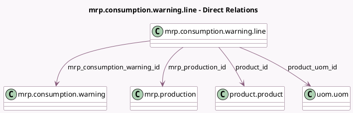

<!-- GENERATED:MODEL -->
---
tags: [odoo, community, generated, model]
---

# mrp.consumption.warning.line

- Module: [[docs/Community Addons/mrp/mrp|mrp]]
- Scope: Community Addons
- Defined in module: yes
- Source files: `wizard/mrp_consumption_warning.py`
- Python classes: `MrpConsumptionWarningLine`
- Description: Line of issue consumption

## Field footprint

- Detected fields: 7
- Field types: `Float` x 2, `Many2one` x 4, `Selection` x 1
- Relation fields: 4

## Sample fields

- `consumption`: `Selection` (related `mrp_production_id.consumption`)
- `mrp_consumption_warning_id`: `Many2one` (comodel `mrp.consumption.warning`)
- `mrp_production_id`: `Many2one` (comodel `mrp.production`)
- `product_consumed_qty_uom`: `Float` (comodel `Consumed`)
- `product_expected_qty_uom`: `Float` (comodel `To Consume`)
- `product_id`: `Many2one` (comodel `product.product`)
- `product_uom_id`: `Many2one` (comodel `uom.uom`, related `product_id.uom_id`)

## Method hints

- Detected methods: 0
- Action methods: none
- Compute methods: none
- Onchange methods: none

## Direct relation diagram

## Navigation

- **Parent:** [[docs/Community Addons/mrp/Models]]

<!-- GENERATED:MODEL -->
