<!-- GENERATED:MODEL -->
---
tags: [odoo, community, generated, model]
---

# mrp.consumption.warning

- Module: [[docs/Community Addons/mrp/mrp|mrp]]
- Scope: Community Addons
- Defined in module: yes
- Source files: `wizard/mrp_consumption_warning.py`
- Python classes: `MrpConsumptionWarning`
- Description: Wizard in case of consumption in warning/strict and more component has been used for a MO (related to the bom)

## Field footprint

- Detected fields: 4
- Field types: `Integer` x 1, `Many2many` x 1, `One2many` x 1, `Selection` x 1
- Relation fields: 2

## Sample fields

- `consumption`: `Selection` (compute `_compute_consumption`)
- `mrp_consumption_warning_line_ids`: `One2many` (comodel `mrp.consumption.warning.line`)
- `mrp_production_count`: `Integer` (compute `_compute_mrp_production_count`)
- `mrp_production_ids`: `Many2many` (comodel `mrp.production`)

## Method hints

- Detected methods: 5
- Action methods: `action_cancel`, `action_confirm`, `action_set_qty`
- Compute methods: `_compute_consumption`, `_compute_mrp_production_count`
- Onchange methods: none

## Direct relation diagram

```plantuml
@startuml
!define ODOO_COLOR_PRIMARY #714B67
!define ODOO_COLOR_ACCENT #875A7B
!define ODOO_COLOR_BG #FAF7FA

skinparam backgroundColor ODOO_COLOR_BG
skinparam defaultTextAlignment left
skinparam ArrowColor ODOO_COLOR_ACCENT
skinparam ClassBackgroundColor white
skinparam ClassBorderColor ODOO_COLOR_PRIMARY
skinparam ComponentBackgroundColor white
skinparam ComponentBorderColor ODOO_COLOR_PRIMARY
skinparam NoteBackgroundColor #FFF8FF
skinparam NoteBorderColor ODOO_COLOR_ACCENT
skinparam SequenceLifeLineBorderColor ODOO_COLOR_ACCENT
skinparam SequenceLifeLineBackgroundColor #FFFFFF
skinparam SequenceParticipantBorderColor ODOO_COLOR_PRIMARY
skinparam SequenceParticipantBackgroundColor #FFFFFF
skinparam sequence {
  ArrowColor ODOO_COLOR_ACCENT
  ActorBorderColor ODOO_COLOR_PRIMARY
}
title mrp.consumption.warning - Direct Relations
class "mrp.consumption.warning" as mrp_consumption_warning
class "mrp.consumption.warning.line" as mrp_consumption_warning_line
class "mrp.production" as mrp_production
mrp_consumption_warning .. mrp_production : mrp_production_ids
mrp_consumption_warning --|> mrp_consumption_warning_line : mrp_consumption_warning_line_ids
@enduml
```

## Navigation

- **Parent:** [[docs/Community Addons/mrp/Models]]

<!-- GENERATED:MODEL -->
