<!-- GENERATED:MODEL -->
---
tags: [odoo, community, generated, model]
---

# mrp.production.backorder

- Module: [[docs/Community Addons/mrp/mrp|mrp]]
- Scope: Community Addons
- Defined in module: yes
- Source files: `wizard/mrp_production_backorder.py`
- Python classes: `MrpProductionBackorder`
- Description: Wizard to mark as done or create back order

## Field footprint

- Detected fields: 3
- Field types: `Boolean` x 1, `Many2many` x 1, `One2many` x 1
- Relation fields: 2

## Sample fields

- `mrp_production_backorder_line_ids`: `One2many` (comodel `mrp.production.backorder.line`)
- `mrp_production_ids`: `Many2many` (comodel `mrp.production`)
- `show_backorder_lines`: `Boolean` (comodel `Show backorder lines`, compute `_compute_show_backorder_lines`)

## Method hints

- Detected methods: 3
- Action methods: `action_backorder`, `action_close_mo`
- Compute methods: `_compute_show_backorder_lines`
- Onchange methods: none

## Direct relation diagram

```plantuml
@startuml
!define ODOO_COLOR_PRIMARY #714B67
!define ODOO_COLOR_ACCENT #875A7B
!define ODOO_COLOR_BG #FAF7FA

skinparam backgroundColor ODOO_COLOR_BG
skinparam defaultTextAlignment left
skinparam ArrowColor ODOO_COLOR_ACCENT
skinparam ClassBackgroundColor white
skinparam ClassBorderColor ODOO_COLOR_PRIMARY
skinparam ComponentBackgroundColor white
skinparam ComponentBorderColor ODOO_COLOR_PRIMARY
skinparam NoteBackgroundColor #FFF8FF
skinparam NoteBorderColor ODOO_COLOR_ACCENT
skinparam SequenceLifeLineBorderColor ODOO_COLOR_ACCENT
skinparam SequenceLifeLineBackgroundColor #FFFFFF
skinparam SequenceParticipantBorderColor ODOO_COLOR_PRIMARY
skinparam SequenceParticipantBackgroundColor #FFFFFF
skinparam sequence {
  ArrowColor ODOO_COLOR_ACCENT
  ActorBorderColor ODOO_COLOR_PRIMARY
}
title mrp.production.backorder - Direct Relations
class "mrp.production.backorder" as mrp_production_backorder
class "mrp.production" as mrp_production
class "mrp.production.backorder.line" as mrp_production_backorder_line
mrp_production_backorder .. mrp_production : mrp_production_ids
mrp_production_backorder --|> mrp_production_backorder_line : mrp_production_backorder_line_ids
@enduml
```

## Navigation

- **Parent:** [[docs/Community Addons/mrp/Models]]

<!-- GENERATED:MODEL -->
