<!-- GENERATED:MODEL -->
---
tags: [odoo, community, generated, model]
---

# mrp.production.group

- Module: [[docs/Community Addons/mrp/mrp|mrp]]
- Scope: Community Addons
- Defined in module: yes
- Source files: `models/mrp_production.py`
- Python classes: `MrpProductionGroup`
- Description: Production Group

## Field footprint

- Detected fields: 4
- Field types: `Char` x 1, `Many2many` x 2, `One2many` x 1
- Relation fields: 3

## Sample fields

- `child_ids`: `Many2many` (comodel `mrp.production.group`)
- `name`: `Char` (comodel `Name`)
- `parent_ids`: `Many2many` (comodel `mrp.production.group`)
- `production_ids`: `One2many` (comodel `mrp.production`)

## Method hints

- Detected methods: 0
- Action methods: none
- Compute methods: none
- Onchange methods: none

## Direct relation diagram

```plantuml
@startuml
!define ODOO_COLOR_PRIMARY #714B67
!define ODOO_COLOR_ACCENT #875A7B
!define ODOO_COLOR_BG #FAF7FA

skinparam backgroundColor ODOO_COLOR_BG
skinparam defaultTextAlignment left
skinparam ArrowColor ODOO_COLOR_ACCENT
skinparam ClassBackgroundColor white
skinparam ClassBorderColor ODOO_COLOR_PRIMARY
skinparam ComponentBackgroundColor white
skinparam ComponentBorderColor ODOO_COLOR_PRIMARY
skinparam NoteBackgroundColor #FFF8FF
skinparam NoteBorderColor ODOO_COLOR_ACCENT
skinparam SequenceLifeLineBorderColor ODOO_COLOR_ACCENT
skinparam SequenceLifeLineBackgroundColor #FFFFFF
skinparam SequenceParticipantBorderColor ODOO_COLOR_PRIMARY
skinparam SequenceParticipantBackgroundColor #FFFFFF
skinparam sequence {
  ArrowColor ODOO_COLOR_ACCENT
  ActorBorderColor ODOO_COLOR_PRIMARY
}
title mrp.production.group - Direct Relations
class "mrp.production.group" as mrp_production_group
class "mrp.production" as mrp_production
class "mrp.production.group" as mrp_production_group
mrp_production_group --|> mrp_production : production_ids
mrp_production_group .. mrp_production_group : child_ids
mrp_production_group .. mrp_production_group : parent_ids
@enduml
```

## Navigation

- **Parent:** [[docs/Community Addons/mrp/Models]]

<!-- GENERATED:MODEL -->
