<!-- GENERATED:MODEL -->
---
tags: [odoo, community, generated, model]
---

# mrp.production

- Module: [[docs/Community Addons/mrp/mrp|mrp]]
- Scope: Community Addons
- Defined in module: yes
- Source files: `models/mrp_production.py`
- Python classes: `MrpProduction`
- Description: Manufacturing Order
- Inherits: `mail.activity.mixin`, `mail.thread`, `product.catalog.mixin`

## Field footprint

- Detected fields: 80
- Field types: `Boolean` x 17, `Char` x 5, `Datetime` x 4, `Float` x 7, `Integer` x 8, `Many2many` x 7, `Many2one` x 15, `One2many` x 10, `Selection` x 7
- Relation fields: 32

## Sample fields

- `all_move_ids`: `One2many` (comodel `stock.move`)
- `all_move_raw_ids`: `One2many` (comodel `stock.move`)
- `allow_workorder_dependencies`: `Boolean` (comodel `Allow Work Order Dependencies`)
- `allowed_uom_ids`: `Many2many` (comodel `uom.uom`, compute `_compute_allowed_uom_ids`)
- `backorder_sequence`: `Integer` (comodel `Backorder Sequence`)
- `bom_id`: `Many2one` (comodel `mrp.bom`, compute `_compute_bom_id`, store `True`)
- `company_id`: `Many2one` (comodel `res.company`)
- `components_availability`: `Char` (compute `_compute_components_availability`)
- `components_availability_state`: `Selection` (compute `_compute_components_availability`)
- `consumption`: `Selection`
- `date_deadline`: `Datetime` (comodel `Deadline`, compute `_compute_date_deadline`, store `True`)
- `date_finished`: `Datetime` (comodel `End`, compute `_compute_date_finished`, store `True`)
- `date_start`: `Datetime` (comodel `Start`)
- `delay_alert_date`: `Datetime` (comodel `Delay Alert Date`, compute `_compute_delay_alert_date`)
- `delivery_count`: `Integer` (compute `_compute_picking_ids`)
- `duration`: `Float` (comodel `Real Duration`, compute `_compute_duration`)
- `duration_expected`: `Float` (comodel `Expected Duration`, compute `_compute_duration_expected`)
- `finished_move_line_ids`: `One2many` (comodel `stock.move.line`, compute `_compute_lines`)
- `forecasted_issue`: `Boolean` (compute `_compute_forecasted_issue`)
- `is_delayed`: `Boolean` (compute `_compute_is_delayed`)

## Method hints

- Detected methods: 154
- Action methods: `action_assign`, `action_cancel`, `action_clear_lot_producing_ids`, `action_confirm`, `action_generate_bom`, `action_generate_serial`, `action_merge`, `action_open_label_layout`, and 15 more
- Compute methods: `_compute_allowed_uom_ids`, `_compute_bom_id`, `_compute_components_availability`, `_compute_date_deadline`, `_compute_date_finished`, `_compute_delay_alert_date`, `_compute_duration`, `_compute_duration_expected`, and 33 more
- Onchange methods: `_onchange_lot_producing`, `_onchange_qty_producing`

## Direct relation diagram

```plantuml
@startuml
!define ODOO_COLOR_PRIMARY #714B67
!define ODOO_COLOR_ACCENT #875A7B
!define ODOO_COLOR_BG #FAF7FA

skinparam backgroundColor ODOO_COLOR_BG
skinparam defaultTextAlignment left
skinparam ArrowColor ODOO_COLOR_ACCENT
skinparam ClassBackgroundColor white
skinparam ClassBorderColor ODOO_COLOR_PRIMARY
skinparam ComponentBackgroundColor white
skinparam ComponentBorderColor ODOO_COLOR_PRIMARY
skinparam NoteBackgroundColor #FFF8FF
skinparam NoteBorderColor ODOO_COLOR_ACCENT
skinparam SequenceLifeLineBorderColor ODOO_COLOR_ACCENT
skinparam SequenceLifeLineBackgroundColor #FFFFFF
skinparam SequenceParticipantBorderColor ODOO_COLOR_PRIMARY
skinparam SequenceParticipantBackgroundColor #FFFFFF
skinparam sequence {
  ArrowColor ODOO_COLOR_ACCENT
  ActorBorderColor ODOO_COLOR_PRIMARY
}
title mrp.production - Direct Relations
class "mrp.production" as mrp_production
class "mrp.bom" as mrp_bom
class "mrp.production.group" as mrp_production_group
class "mrp.unbuild" as mrp_unbuild
class "mrp.workcenter" as mrp_workcenter
class "mrp.workorder" as mrp_workorder
class "product.product" as product_product
class "product.template" as product_template
class "product.template.attribute.value" as product_template_attribute_value
class "res.company" as res_company
class "res.users" as res_users
class "stock.location" as stock_location
class "stock.lot" as stock_lot
mrp_production --> product_product : product_id
mrp_production --> mrp_production_group : production_group_id
mrp_production .. product_template_attribute_value : product_variant_attributes
mrp_production .. product_template_attribute_value : never_product_template_attribute_value_ids
mrp_production --> mrp_workcenter : workcenter_id
mrp_production --> product_template : product_tmpl_id
mrp_production .. uom_uom : allowed_uom_ids
mrp_production --> uom_uom : product_uom_id
mrp_production .. stock_lot : lot_producing_ids
mrp_production --> stock_picking_type : picking_type_id
mrp_production --> stock_location : location_src_id
mrp_production --> stock_location : location_dest_id
mrp_production --> stock_location : location_final_id
mrp_production --> mrp_bom : bom_id
mrp_production --|> stock_move : move_raw_ids
mrp_production --|> stock_move : move_finished_ids
@enduml
```

## Navigation

- **Parent:** [[docs/Community Addons/mrp/Models]]

<!-- GENERATED:MODEL -->
