<!-- GENERATED:MODEL -->
---
tags: [odoo, community, generated, model]
---

# mrp.production.serials

- Module: [[docs/Community Addons/mrp/mrp|mrp]]
- Scope: Community Addons
- Defined in module: yes
- Source files: `wizard/mrp_production_serial_numbers.py`
- Python classes: `MrpProductionSerials`
- Description: Assign serial numbers to production order

## Field footprint

- Detected fields: 5
- Field types: `Char` x 1, `Integer` x 1, `Many2one` x 2, `Text` x 1
- Relation fields: 2

## Sample fields

- `lot_name`: `Char` (comodel `First SN`, compute `_compute_lot_name`, store `True`)
- `lot_quantity`: `Integer` (comodel `Number of SN`, compute `_compute_lot_quantity`, store `True`)
- `production_id`: `Many2one` (comodel `mrp.production`)
- `serial_numbers`: `Text` (comodel `Produced Serial Numbers`, compute `_compute_lot_name`, store `True`)
- `workorder_id`: `Many2one` (comodel `mrp.workorder`)

## Method hints

- Detected methods: 5
- Action methods: `action_apply`, `action_generate_serial_numbers`
- Compute methods: `_compute_lot_name`, `_compute_lot_quantity`
- Onchange methods: `_onchange_serial_numbers`

## Direct relation diagram

```plantuml
@startuml
!define ODOO_COLOR_PRIMARY #714B67
!define ODOO_COLOR_ACCENT #875A7B
!define ODOO_COLOR_BG #FAF7FA

skinparam backgroundColor ODOO_COLOR_BG
skinparam defaultTextAlignment left
skinparam ArrowColor ODOO_COLOR_ACCENT
skinparam ClassBackgroundColor white
skinparam ClassBorderColor ODOO_COLOR_PRIMARY
skinparam ComponentBackgroundColor white
skinparam ComponentBorderColor ODOO_COLOR_PRIMARY
skinparam NoteBackgroundColor #FFF8FF
skinparam NoteBorderColor ODOO_COLOR_ACCENT
skinparam SequenceLifeLineBorderColor ODOO_COLOR_ACCENT
skinparam SequenceLifeLineBackgroundColor #FFFFFF
skinparam SequenceParticipantBorderColor ODOO_COLOR_PRIMARY
skinparam SequenceParticipantBackgroundColor #FFFFFF
skinparam sequence {
  ArrowColor ODOO_COLOR_ACCENT
  ActorBorderColor ODOO_COLOR_PRIMARY
}
title mrp.production.serials - Direct Relations
class "mrp.production.serials" as mrp_production_serials
class "mrp.production" as mrp_production
class "mrp.workorder" as mrp_workorder
mrp_production_serials --> mrp_production : production_id
mrp_production_serials --> mrp_workorder : workorder_id
@enduml
```

## Navigation

- **Parent:** [[docs/Community Addons/mrp/Models]]

<!-- GENERATED:MODEL -->
