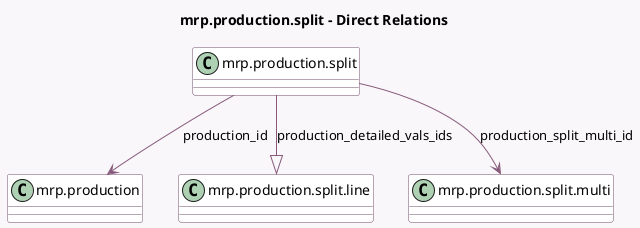

<!-- GENERATED:MODEL -->
---
tags: [odoo, community, generated, model]
---

# mrp.production.split

- Module: [[docs/Community Addons/mrp/mrp|mrp]]
- Scope: Community Addons
- Defined in module: yes
- Source files: `wizard/mrp_production_split.py`
- Python classes: `MrpProductionSplit`
- Description: Wizard to Split a Production

## Field footprint

- Detected fields: 10
- Field types: `Boolean` x 1, `Float` x 3, `Integer` x 1, `Many2one` x 4, `One2many` x 1
- Relation fields: 5

## Sample fields

- `max_batch_size`: `Float` (comodel `Max Batch Size`, compute `_compute_max_batch_size`)
- `num_splits`: `Integer` (comodel `# Splits`, compute `_compute_num_splits`)
- `product_id`: `Many2one` (related `production_id.product_id`)
- `product_qty`: `Float` (related `production_id.product_qty`)
- `product_uom_id`: `Many2one` (related `production_id.product_uom_id`)
- `production_capacity`: `Float` (related `production_id.production_capacity`)
- `production_detailed_vals_ids`: `One2many` (comodel `mrp.production.split.line`, compute `_compute_details`, store `True`)
- `production_id`: `Many2one` (comodel `mrp.production`)
- `production_split_multi_id`: `Many2one` (comodel `mrp.production.split.multi`)
- `valid_details`: `Boolean` (comodel `Valid`, compute `_compute_valid_details`)

## Method hints

- Detected methods: 7
- Action methods: `action_prepare_split`, `action_return_to_list`, `action_split`
- Compute methods: `_compute_details`, `_compute_max_batch_size`, `_compute_num_splits`, `_compute_valid_details`
- Onchange methods: none

## Direct relation diagram

## Navigation

- **Parent:** [[docs/Community Addons/mrp/Models]]

<!-- GENERATED:MODEL -->
