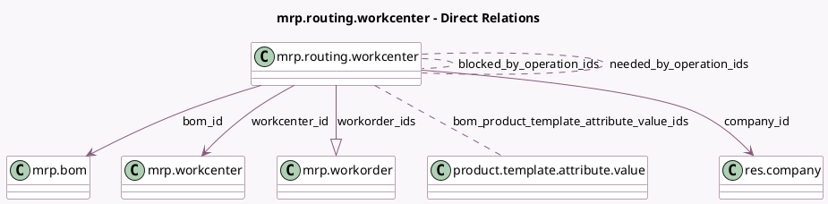

<!-- GENERATED:MODEL -->
---
tags: [odoo, community, generated, model]
---

# mrp.routing.workcenter

- Module: [[docs/Community Addons/mrp/mrp|mrp]]
- Scope: Community Addons
- Defined in module: yes
- Source files: `models/mrp_routing.py`
- Python classes: `MrpRoutingWorkcenter`
- Description: Work Center Usage
- Inherits: `mail.activity.mixin`, `mail.thread`

## Field footprint

- Detected fields: 23
- Field types: `Boolean` x 3, `Char` x 2, `Float` x 4, `Integer` x 4, `Many2many` x 4, `Many2one` x 3, `One2many` x 1, `Selection` x 2
- Relation fields: 8

## Sample fields

- `active`: `Boolean`
- `allow_operation_dependencies`: `Boolean` (related `bom_id.allow_operation_dependencies`)
- `blocked_by_operation_ids`: `Many2many` (comodel `mrp.routing.workcenter`)
- `bom_id`: `Many2one` (comodel `mrp.bom`)
- `bom_product_template_attribute_value_ids`: `Many2many` (comodel `product.template.attribute.value`)
- `company_id`: `Many2one` (comodel `res.company`, related `bom_id.company_id`)
- `cost`: `Float` (comodel `Cost`, compute `_compute_cost`)
- `cost_mode`: `Selection`
- `cycle_number`: `Integer` (comodel `Repetitions`, compute `_compute_time_cycle`)
- `name`: `Char` (comodel `Operation`)
- `needed_by_operation_ids`: `Many2many` (comodel `mrp.routing.workcenter`)
- `possible_bom_product_template_attribute_value_ids`: `Many2many` (related `bom_id.possible_product_template_attribute_value_ids`)
- `sequence`: `Integer` (comodel `Sequence`)
- `show_time_total`: `Boolean` (comodel `Show Total Duration?`, compute `_compute_time_cycle`)
- `time_computed_on`: `Char` (comodel `Computed on last`, compute `_compute_time_computed_on`)
- `time_cycle`: `Float` (comodel `Cycles`, compute `_compute_time_cycle`)
- `time_cycle_manual`: `Float` (comodel `Manual Duration`)
- `time_mode`: `Selection`
- `time_mode_batch`: `Integer` (comodel `Based on`)
- `time_total`: `Float` (comodel `Total Duration`, compute `_compute_time_cycle`)

## Method hints

- Detected methods: 13
- Action methods: `action_archive`, `action_open_operation_form`, `action_unarchive`
- Compute methods: `_compute_cost`, `_compute_time_computed_on`, `_compute_time_cycle`, `_compute_workorder_count`
- Onchange methods: none

## Direct relation diagram

## Navigation

- **Parent:** [[docs/Community Addons/mrp/Models]]

<!-- GENERATED:MODEL -->
