<!-- GENERATED:MODEL -->
---
tags: [odoo, community, generated, model]
---

# mrp.unbuild

- Module: [[docs/Community Addons/mrp/mrp|mrp]]
- Scope: Community Addons
- Defined in module: yes
- Source files: `models/mrp_unbuild.py`
- Python classes: `MrpUnbuild`
- Description: Unbuild Order
- Inherits: `mail.activity.mixin`, `mail.thread`

## Field footprint

- Detected fields: 16
- Field types: `Char` x 1, `Float` x 1, `Many2many` x 1, `Many2one` x 9, `One2many` x 2, `Selection` x 2
- Relation fields: 12

## Sample fields

- `bom_id`: `Many2one` (comodel `mrp.bom`, compute `_compute_bom_id`, store `True`)
- `company_id`: `Many2one` (comodel `res.company`)
- `consume_line_ids`: `One2many` (comodel `stock.move`)
- `has_tracking`: `Selection` (related `product_id.tracking`)
- `location_dest_id`: `Many2one` (comodel `stock.location`, compute `_compute_location_id`, store `True`)
- `location_id`: `Many2one` (comodel `stock.location`, compute `_compute_location_id`, store `True`)
- `lot_id`: `Many2one` (comodel `stock.lot`)
- `lot_producing_ids`: `Many2many` (comodel `stock.lot`, related `mo_id.lot_producing_ids`)
- `mo_bom_id`: `Many2one` (comodel `mrp.bom`, related `mo_id.bom_id`)
- `mo_id`: `Many2one` (comodel `mrp.production`)
- `name`: `Char` (comodel `Reference`)
- `produce_line_ids`: `One2many` (comodel `stock.move`)
- `product_id`: `Many2one` (comodel `product.product`, compute `_compute_product_id`, store `True`)
- `product_qty`: `Float` (comodel `Quantity`, compute `_compute_product_qty`, store `True`)
- `product_uom_id`: `Many2one` (comodel `uom.uom`, compute `_compute_product_uom_id`, store `True`)
- `state`: `Selection`

## Method hints

- Detected methods: 15
- Action methods: `action_unbuild`, `action_validate`
- Compute methods: `_compute_bom_id`, `_compute_location_id`, `_compute_product_id`, `_compute_product_qty`, `_compute_product_uom_id`
- Onchange methods: none

## Direct relation diagram

```plantuml
@startuml
!define ODOO_COLOR_PRIMARY #714B67
!define ODOO_COLOR_ACCENT #875A7B
!define ODOO_COLOR_BG #FAF7FA

skinparam backgroundColor ODOO_COLOR_BG
skinparam defaultTextAlignment left
skinparam ArrowColor ODOO_COLOR_ACCENT
skinparam ClassBackgroundColor white
skinparam ClassBorderColor ODOO_COLOR_PRIMARY
skinparam ComponentBackgroundColor white
skinparam ComponentBorderColor ODOO_COLOR_PRIMARY
skinparam NoteBackgroundColor #FFF8FF
skinparam NoteBorderColor ODOO_COLOR_ACCENT
skinparam SequenceLifeLineBorderColor ODOO_COLOR_ACCENT
skinparam SequenceLifeLineBackgroundColor #FFFFFF
skinparam SequenceParticipantBorderColor ODOO_COLOR_PRIMARY
skinparam SequenceParticipantBackgroundColor #FFFFFF
skinparam sequence {
  ArrowColor ODOO_COLOR_ACCENT
  ActorBorderColor ODOO_COLOR_PRIMARY
}
title mrp.unbuild - Direct Relations
class "mrp.unbuild" as mrp_unbuild
class "mrp.bom" as mrp_bom
class "mrp.production" as mrp_production
class "product.product" as product_product
class "res.company" as res_company
class "stock.location" as stock_location
class "stock.lot" as stock_lot
class "stock.move" as stock_move
class "uom.uom" as uom_uom
mrp_unbuild --> product_product : product_id
mrp_unbuild --> res_company : company_id
mrp_unbuild --> uom_uom : product_uom_id
mrp_unbuild --> mrp_bom : bom_id
mrp_unbuild --> mrp_production : mo_id
mrp_unbuild --> mrp_bom : mo_bom_id
mrp_unbuild .. stock_lot : lot_producing_ids
mrp_unbuild --> stock_lot : lot_id
mrp_unbuild --> stock_location : location_id
mrp_unbuild --> stock_location : location_dest_id
mrp_unbuild --|> stock_move : consume_line_ids
mrp_unbuild --|> stock_move : produce_line_ids
@enduml
```

## Navigation

- **Parent:** [[docs/Community Addons/mrp/Models]]

<!-- GENERATED:MODEL -->
