<!-- GENERATED:MODEL -->
---
tags: [odoo, community, generated, model]
---

# mrp.workcenter.capacity

- Module: [[docs/Community Addons/mrp/mrp|mrp]]
- Scope: Community Addons
- Defined in module: yes
- Source files: `models/mrp_workcenter.py`
- Python classes: `MrpWorkcenterCapacity`
- Description: Work Center Capacity

## Field footprint

- Detected fields: 6
- Field types: `Float` x 3, `Many2one` x 3
- Relation fields: 3

## Sample fields

- `capacity`: `Float` (comodel `Capacity`)
- `product_id`: `Many2one` (comodel `product.product`)
- `product_uom_id`: `Many2one` (comodel `uom.uom`, compute `_compute_product_uom_id`, store `True`)
- `time_start`: `Float` (comodel `Setup Time (minutes)`)
- `time_stop`: `Float` (comodel `Cleanup Time (minutes)`)
- `workcenter_id`: `Many2one` (comodel `mrp.workcenter`)

## Method hints

- Detected methods: 3
- Action methods: none
- Compute methods: `_compute_product_uom_id`
- Onchange methods: none

## Direct relation diagram

```plantuml
@startuml
!define ODOO_COLOR_PRIMARY #714B67
!define ODOO_COLOR_ACCENT #875A7B
!define ODOO_COLOR_BG #FAF7FA

skinparam backgroundColor ODOO_COLOR_BG
skinparam defaultTextAlignment left
skinparam ArrowColor ODOO_COLOR_ACCENT
skinparam ClassBackgroundColor white
skinparam ClassBorderColor ODOO_COLOR_PRIMARY
skinparam ComponentBackgroundColor white
skinparam ComponentBorderColor ODOO_COLOR_PRIMARY
skinparam NoteBackgroundColor #FFF8FF
skinparam NoteBorderColor ODOO_COLOR_ACCENT
skinparam SequenceLifeLineBorderColor ODOO_COLOR_ACCENT
skinparam SequenceLifeLineBackgroundColor #FFFFFF
skinparam SequenceParticipantBorderColor ODOO_COLOR_PRIMARY
skinparam SequenceParticipantBackgroundColor #FFFFFF
skinparam sequence {
  ArrowColor ODOO_COLOR_ACCENT
  ActorBorderColor ODOO_COLOR_PRIMARY
}
title mrp.workcenter.capacity - Direct Relations
class "mrp.workcenter.capacity" as mrp_workcenter_capacity
class "mrp.workcenter" as mrp_workcenter
class "product.product" as product_product
class "uom.uom" as uom_uom
mrp_workcenter_capacity --> mrp_workcenter : workcenter_id
mrp_workcenter_capacity --> product_product : product_id
mrp_workcenter_capacity --> uom_uom : product_uom_id
@enduml
```

## Navigation

- **Parent:** [[docs/Community Addons/mrp/Models]]

<!-- GENERATED:MODEL -->
