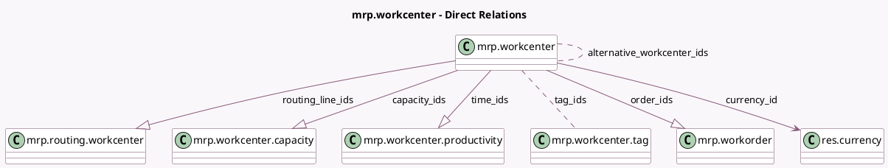

<!-- GENERATED:MODEL -->
---
tags: [odoo, community, generated, model]
---

# mrp.workcenter

- Module: [[docs/Community Addons/mrp/mrp|mrp]]
- Scope: Community Addons
- Defined in module: yes
- Source files: `models/mrp_workcenter.py`
- Python classes: `MrpWorkcenter`
- Description: Work Center
- Inherits: `mail.thread`, `resource.mixin`

## Field footprint

- Detected fields: 32
- Field types: `Boolean` x 2, `Char` x 2, `Float` x 9, `Html` x 1, `Integer` x 8, `Many2many` x 2, `Many2one` x 2, `One2many` x 4, `Selection` x 1, `Text` x 1
- Relation fields: 8

## Sample fields

- `active`: `Boolean` (comodel `Active`, related `resource_id.active`, store `True`)
- `alternative_workcenter_ids`: `Many2many` (comodel `mrp.workcenter`)
- `blocked_time`: `Float` (comodel `Blocked Time`, compute `_compute_blocked_time`)
- `capacity_ids`: `One2many` (comodel `mrp.workcenter.capacity`)
- `code`: `Char` (comodel `Code`)
- `color`: `Integer` (comodel `Color`)
- `costs_hour`: `Float`
- `currency_id`: `Many2one` (comodel `res.currency`, related `company_id.currency_id`)
- `has_routing_lines`: `Boolean` (compute `_compute_has_routing_lines`)
- `kanban_dashboard_graph`: `Text` (compute `_compute_kanban_dashboard_graph`)
- `name`: `Char` (comodel `Work Center`, related `resource_id.name`, store `True`)
- `note`: `Html` (comodel `Description`)
- `oee`: `Float` (compute `_compute_oee`)
- `oee_target`: `Float`
- `order_ids`: `One2many` (comodel `mrp.workorder`)
- `performance`: `Integer` (comodel `Performance`, compute `_compute_performance`)
- `productive_time`: `Float` (comodel `Productive Time`, compute `_compute_productive_time`)
- `resource_calendar_id`: `Many2one`
- `routing_line_ids`: `One2many` (comodel `mrp.routing.workcenter`)
- `sequence`: `Integer` (comodel `Sequence`)

## Method hints

- Detected methods: 23
- Action methods: `action_archive`, `action_show_operations`, `action_work_order`, `action_work_order_alternatives`
- Compute methods: `_compute_blocked_time`, `_compute_display_name`, `_compute_has_routing_lines`, `_compute_kanban_dashboard_graph`, `_compute_oee`, `_compute_performance`, `_compute_productive_time`, `_compute_working_state`, and 1 more
- Onchange methods: none

## Direct relation diagram

## Navigation

- **Parent:** [[docs/Community Addons/mrp/Models]]

<!-- GENERATED:MODEL -->
