<!-- GENERATED:MODEL -->
---
tags: [odoo, community, generated, model]
---

# mrp.workcenter.productivity.loss

- Module: [[docs/Community Addons/mrp/mrp|mrp]]
- Scope: Community Addons
- Defined in module: yes
- Source files: `models/mrp_workcenter.py`
- Python classes: `MrpWorkcenterProductivityLoss`
- Description: Workcenter Productivity Losses

## Field footprint

- Detected fields: 5
- Field types: `Boolean` x 1, `Char` x 1, `Integer` x 1, `Many2one` x 1, `Selection` x 1
- Relation fields: 1

## Sample fields

- `loss_id`: `Many2one` (comodel `mrp.workcenter.productivity.loss.type`)
- `loss_type`: `Selection` (related `loss_id.loss_type`)
- `manual`: `Boolean` (comodel `Is a Blocking Reason`)
- `name`: `Char` (comodel `Blocking Reason`)
- `sequence`: `Integer` (comodel `Sequence`)

## Method hints

- Detected methods: 1
- Action methods: none
- Compute methods: none
- Onchange methods: none

## Direct relation diagram

```plantuml
@startuml
!define ODOO_COLOR_PRIMARY #714B67
!define ODOO_COLOR_ACCENT #875A7B
!define ODOO_COLOR_BG #FAF7FA

skinparam backgroundColor ODOO_COLOR_BG
skinparam defaultTextAlignment left
skinparam ArrowColor ODOO_COLOR_ACCENT
skinparam ClassBackgroundColor white
skinparam ClassBorderColor ODOO_COLOR_PRIMARY
skinparam ComponentBackgroundColor white
skinparam ComponentBorderColor ODOO_COLOR_PRIMARY
skinparam NoteBackgroundColor #FFF8FF
skinparam NoteBorderColor ODOO_COLOR_ACCENT
skinparam SequenceLifeLineBorderColor ODOO_COLOR_ACCENT
skinparam SequenceLifeLineBackgroundColor #FFFFFF
skinparam SequenceParticipantBorderColor ODOO_COLOR_PRIMARY
skinparam SequenceParticipantBackgroundColor #FFFFFF
skinparam sequence {
  ArrowColor ODOO_COLOR_ACCENT
  ActorBorderColor ODOO_COLOR_PRIMARY
}
title mrp.workcenter.productivity.loss - Direct Relations
class "mrp.workcenter.productivity.loss" as mrp_workcenter_productivity_loss
class "mrp.workcenter.productivity.loss.type" as mrp_workcenter_productivity_loss_type
mrp_workcenter_productivity_loss --> mrp_workcenter_productivity_loss_type : loss_id
@enduml
```

## Navigation

- **Parent:** [[docs/Community Addons/mrp/Models]]

<!-- GENERATED:MODEL -->
