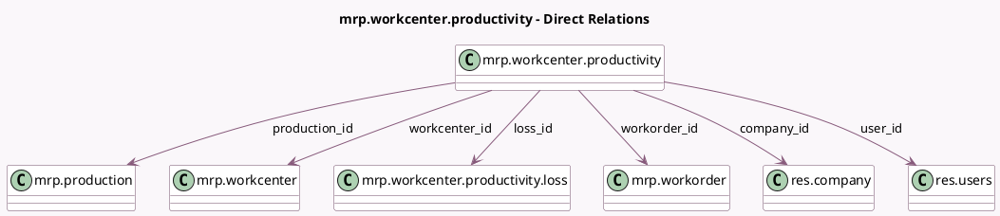

<!-- GENERATED:MODEL -->
---
tags: [odoo, community, generated, model]
---

# mrp.workcenter.productivity

- Module: [[docs/Community Addons/mrp/mrp|mrp]]
- Scope: Community Addons
- Defined in module: yes
- Source files: `models/mrp_workcenter.py`
- Python classes: `MrpWorkcenterProductivity`
- Description: Workcenter Productivity Log

## Field footprint

- Detected fields: 11
- Field types: `Datetime` x 2, `Float` x 1, `Many2one` x 6, `Selection` x 1, `Text` x 1
- Relation fields: 6

## Sample fields

- `company_id`: `Many2one` (comodel `res.company`)
- `date_end`: `Datetime` (comodel `End Date`)
- `date_start`: `Datetime` (comodel `Start Date`)
- `description`: `Text` (comodel `Description`)
- `duration`: `Float` (comodel `Duration`, compute `_compute_duration`, store `True`)
- `loss_id`: `Many2one` (comodel `mrp.workcenter.productivity.loss`)
- `loss_type`: `Selection` (related `loss_id.loss_type`)
- `production_id`: `Many2one` (comodel `mrp.production`, related `workorder_id.production_id`)
- `user_id`: `Many2one` (comodel `res.users`)
- `workcenter_id`: `Many2one` (comodel `mrp.workcenter`)
- `workorder_id`: `Many2one` (comodel `mrp.workorder`)

## Method hints

- Detected methods: 9
- Action methods: none
- Compute methods: `_compute_duration`
- Onchange methods: `_date_end_changed`, `_date_start_changed`, `_duration_changed`

## Direct relation diagram

## Navigation

- **Parent:** [[docs/Community Addons/mrp/Models]]

<!-- GENERATED:MODEL -->
