<!-- GENERATED:MODEL -->
---
tags: [odoo, community, generated, model]
---

# mrp.workorder

- Module: [[docs/Community Addons/mrp/mrp|mrp]]
- Scope: Community Addons
- Defined in module: yes
- Source files: `models/mrp_workorder.py`
- Python classes: `MrpWorkorder`
- Description: Work Order

## Field footprint

- Detected fields: 51
- Field types: `Boolean` x 5, `Char` x 3, `Datetime` x 3, `Float` x 11, `Integer` x 3, `Many2many` x 4, `Many2one` x 9, `One2many` x 6, `Selection` x 7
- Relation fields: 19

## Sample fields

- `allow_workorder_dependencies`: `Boolean` (related `production_id.allow_workorder_dependencies`)
- `barcode`: `Char` (compute `_compute_barcode`, store `True`)
- `blocked_by_workorder_ids`: `Many2many` (comodel `mrp.workorder`)
- `company_id`: `Many2one` (related `production_id.company_id`)
- `consumption`: `Selection` (related `production_id.consumption`)
- `cost_mode`: `Selection`
- `costs_hour`: `Float`
- `date_finished`: `Datetime` (comodel `End`, compute `_compute_dates`, store `True`)
- `date_start`: `Datetime` (comodel `Start`, compute `_compute_dates`, store `True`)
- `duration`: `Float` (comodel `Real Duration`, compute `_compute_duration`, store `True`)
- `duration_expected`: `Float` (comodel `Expected Duration`, compute `_compute_duration_expected`, store `True`)
- `duration_percent`: `Integer` (comodel `Duration Deviation (%)`, compute `_compute_duration`, store `True`)
- `duration_unit`: `Float` (comodel `Duration Per Unit`, compute `_compute_duration`, store `True`)
- `finished_lot_ids`: `Many2many` (comodel `stock.lot`, related `production_id.lot_producing_ids`)
- `is_planned`: `Boolean` (related `production_id.is_planned`)
- `is_produced`: `Boolean` (compute `_compute_is_produced`)
- `is_user_working`: `Boolean` (comodel `Is the Current User Working`, compute `_compute_working_users`)
- `json_popover`: `Char` (comodel `Popover Data JSON`, compute `_compute_json_popover`)
- `last_working_user_id`: `Many2one` (comodel `res.users`, compute `_compute_working_users`)
- `leave_id`: `Many2one` (comodel `resource.calendar.leaves`)

## Method hints

- Detected methods: 60
- Action methods: `action_cancel`, `action_mark_as_done`, `action_open_wizard`, `action_replan`, `action_see_move_scrap`
- Compute methods: `_compute_barcode`, `_compute_current_operation_cost`, `_compute_dates`, `_compute_display_name`, `_compute_duration`, `_compute_duration_expected`, `_compute_expected_operation_cost`, `_compute_is_produced`, and 9 more
- Onchange methods: `_onchange_date_finished`, `_onchange_date_start`, `_onchange_finished_lot_ids`, `_onchange_operation_id`

## Direct relation diagram

```plantuml
@startuml
!define ODOO_COLOR_PRIMARY #714B67
!define ODOO_COLOR_ACCENT #875A7B
!define ODOO_COLOR_BG #FAF7FA

skinparam backgroundColor ODOO_COLOR_BG
skinparam defaultTextAlignment left
skinparam ArrowColor ODOO_COLOR_ACCENT
skinparam ClassBackgroundColor white
skinparam ClassBorderColor ODOO_COLOR_PRIMARY
skinparam ComponentBackgroundColor white
skinparam ComponentBorderColor ODOO_COLOR_PRIMARY
skinparam NoteBackgroundColor #FFF8FF
skinparam NoteBorderColor ODOO_COLOR_ACCENT
skinparam SequenceLifeLineBorderColor ODOO_COLOR_ACCENT
skinparam SequenceLifeLineBackgroundColor #FFFFFF
skinparam SequenceParticipantBorderColor ODOO_COLOR_PRIMARY
skinparam SequenceParticipantBackgroundColor #FFFFFF
skinparam sequence {
  ArrowColor ODOO_COLOR_ACCENT
  ActorBorderColor ODOO_COLOR_PRIMARY
}
title mrp.workorder - Direct Relations
class "mrp.workorder" as mrp_workorder
class "mrp.bom" as mrp_bom
class "mrp.production" as mrp_production
class "mrp.routing.workcenter" as mrp_routing_workcenter
class "mrp.workcenter" as mrp_workcenter
class "mrp.workcenter.productivity" as mrp_workcenter_productivity
class "mrp.workorder" as mrp_workorder
class "product.template.attribute.value" as product_template_attribute_value
class "res.users" as res_users
class "resource.calendar.leaves" as resource_calendar_leaves
class "stock.lot" as stock_lot
class "stock.move" as stock_move
class "stock.move.line" as stock_move_line
mrp_workorder --> mrp_workcenter : workcenter_id
mrp_workorder .. product_template_attribute_value : product_variant_attributes
mrp_workorder --> mrp_production : production_id
mrp_workorder --> mrp_bom : production_bom_id
mrp_workorder --> resource_calendar_leaves : leave_id
mrp_workorder --> mrp_routing_workcenter : operation_id
mrp_workorder --|> stock_move : move_raw_ids
mrp_workorder --|> stock_move : move_finished_ids
mrp_workorder --|> stock_move_line : move_line_ids
mrp_workorder .. stock_lot : finished_lot_ids
mrp_workorder --|> mrp_workcenter_productivity : time_ids
mrp_workorder --|> res_users : working_user_ids
mrp_workorder --> res_users : last_working_user_id
mrp_workorder --|> stock_scrap : scrap_ids
mrp_workorder .. mrp_workorder : blocked_by_workorder_ids
@enduml
```

## Navigation

- **Parent:** [[docs/Community Addons/mrp/Models]]

<!-- GENERATED:MODEL -->
