<!-- GENERATED:MODEL -->
---
tags: [odoo, community, generated, model]
---

# product.template

- Module: [[docs/Community Addons/mrp/mrp|mrp]]
- Scope: Community Addons
- Defined in module: extension only
- Source files: `models/product.py`
- Python classes: `ProductTemplate`

## Field footprint

- Detected fields: 6
- Field types: `Boolean` x 1, `Float` x 1, `Integer` x 2, `One2many` x 2
- Relation fields: 2

## Sample fields

- `bom_count`: `Integer` (comodel `# Bill of Material`, compute `_compute_bom_count`)
- `bom_ids`: `One2many` (comodel `mrp.bom`)
- `bom_line_ids`: `One2many` (comodel `mrp.bom.line`)
- `is_kits`: `Boolean` (compute `_compute_is_kits`)
- `mrp_product_qty`: `Float` (comodel `Manufactured`, compute `_compute_mrp_product_qty`)
- `used_in_bom_count`: `Integer` (comodel `# of BoM Where is Used`, compute `_compute_used_in_bom_count`)

## Method hints

- Detected methods: 12
- Action methods: `action_archive`, `action_used_in_bom`, `action_view_mos`
- Compute methods: `_compute_bom_count`, `_compute_is_kits`, `_compute_mrp_product_qty`, `_compute_show_qty_status_button`, `_compute_used_in_bom_count`
- Onchange methods: none

## Direct relation diagram

```plantuml
@startuml
!define ODOO_COLOR_PRIMARY #714B67
!define ODOO_COLOR_ACCENT #875A7B
!define ODOO_COLOR_BG #FAF7FA

skinparam backgroundColor ODOO_COLOR_BG
skinparam defaultTextAlignment left
skinparam ArrowColor ODOO_COLOR_ACCENT
skinparam ClassBackgroundColor white
skinparam ClassBorderColor ODOO_COLOR_PRIMARY
skinparam ComponentBackgroundColor white
skinparam ComponentBorderColor ODOO_COLOR_PRIMARY
skinparam NoteBackgroundColor #FFF8FF
skinparam NoteBorderColor ODOO_COLOR_ACCENT
skinparam SequenceLifeLineBorderColor ODOO_COLOR_ACCENT
skinparam SequenceLifeLineBackgroundColor #FFFFFF
skinparam SequenceParticipantBorderColor ODOO_COLOR_PRIMARY
skinparam SequenceParticipantBackgroundColor #FFFFFF
skinparam sequence {
  ArrowColor ODOO_COLOR_ACCENT
  ActorBorderColor ODOO_COLOR_PRIMARY
}
title product.template - Direct Relations
class "product.template" as product_template
class "mrp.bom" as mrp_bom
class "mrp.bom.line" as mrp_bom_line
product_template --|> mrp_bom_line : bom_line_ids
product_template --|> mrp_bom : bom_ids
@enduml
```

## Navigation

- **Parent:** [[docs/Community Addons/mrp/Models]]

<!-- GENERATED:MODEL -->
