<!-- GENERATED:MODEL -->
---
tags: [odoo, community, generated, model]
---

# stock.move

- Module: [[docs/Community Addons/mrp/mrp|mrp]]
- Scope: Community Addons
- Defined in module: extension only
- Source files: `models/stock_move.py`
- Python classes: `StockMove`

## Field footprint

- Detected fields: 18
- Field types: `Boolean` x 1, `Float` x 5, `Many2many` x 1, `Many2one` x 10, `One2many` x 1
- Relation fields: 12

## Sample fields

- `allowed_operation_ids`: `One2many` (comodel `mrp.routing.workcenter`, related `raw_material_production_id.bom_id.operation_ids`)
- `bom_line_id`: `Many2one` (comodel `mrp.bom.line`)
- `byproduct_id`: `Many2one` (comodel `mrp.bom.byproduct`)
- `consume_unbuild_id`: `Many2one` (comodel `mrp.unbuild`)
- `cost_share`: `Float` (comodel `Cost Share (%)`)
- `created_production_id`: `Many2one` (comodel `mrp.production`)
- `manual_consumption`: `Boolean` (comodel `Manual Consumption`, compute `_compute_manual_consumption`, store `True`)
- `operation_id`: `Many2one` (comodel `mrp.routing.workcenter`)
- `order_finished_lot_ids`: `Many2many` (comodel `stock.lot`, related `raw_material_production_id.lot_producing_ids`)
- `product_qty_available`: `Float` (comodel `Product On Hand Quantity`, related `product_id.qty_available`)
- `product_virtual_available`: `Float` (comodel `Product Forecasted Quantity`, related `product_id.virtual_available`)
- `production_group_id`: `Many2one` (comodel `mrp.production.group`)
- `production_id`: `Many2one` (comodel `mrp.production`)
- `raw_material_production_id`: `Many2one` (comodel `mrp.production`)
- `should_consume_qty`: `Float` (comodel `Quantity To Consume`, compute `_compute_should_consume_qty`)
- `unbuild_id`: `Many2one` (comodel `mrp.unbuild`)
- `unit_factor`: `Float` (comodel `Unit Factor`, compute `_compute_unit_factor`, store `True`)
- `workorder_id`: `Many2one` (comodel `mrp.workorder`)

## Method hints

- Detected methods: 54
- Action methods: `action_add_from_catalog_byproduct`, `action_add_from_catalog_raw`, `action_explode`, `action_open_reference`, `action_show_details`
- Compute methods: `_compute_allowed_uom_ids`, `_compute_description_picking`, `_compute_display_assign_serial`, `_compute_is_locked`, `_compute_kit_quantities`, `_compute_location_dest_id`, `_compute_location_id`, `_compute_manual_consumption`, and 7 more
- Onchange methods: `_onchange_product_uom_qty`, `_onchange_quantity`

## Direct relation diagram

```plantuml
@startuml
!define ODOO_COLOR_PRIMARY #714B67
!define ODOO_COLOR_ACCENT #875A7B
!define ODOO_COLOR_BG #FAF7FA

skinparam backgroundColor ODOO_COLOR_BG
skinparam defaultTextAlignment left
skinparam ArrowColor ODOO_COLOR_ACCENT
skinparam ClassBackgroundColor white
skinparam ClassBorderColor ODOO_COLOR_PRIMARY
skinparam ComponentBackgroundColor white
skinparam ComponentBorderColor ODOO_COLOR_PRIMARY
skinparam NoteBackgroundColor #FFF8FF
skinparam NoteBorderColor ODOO_COLOR_ACCENT
skinparam SequenceLifeLineBorderColor ODOO_COLOR_ACCENT
skinparam SequenceLifeLineBackgroundColor #FFFFFF
skinparam SequenceParticipantBorderColor ODOO_COLOR_PRIMARY
skinparam SequenceParticipantBackgroundColor #FFFFFF
skinparam sequence {
  ArrowColor ODOO_COLOR_ACCENT
  ActorBorderColor ODOO_COLOR_PRIMARY
}
title stock.move - Direct Relations
class "stock.move" as stock_move
class "mrp.bom.byproduct" as mrp_bom_byproduct
class "mrp.bom.line" as mrp_bom_line
class "mrp.production" as mrp_production
class "mrp.production.group" as mrp_production_group
class "mrp.routing.workcenter" as mrp_routing_workcenter
class "mrp.unbuild" as mrp_unbuild
class "mrp.workorder" as mrp_workorder
class "stock.lot" as stock_lot
stock_move --> mrp_production : created_production_id
stock_move --> mrp_production : production_id
stock_move --> mrp_production : raw_material_production_id
stock_move --> mrp_production_group : production_group_id
stock_move --> mrp_unbuild : unbuild_id
stock_move --> mrp_unbuild : consume_unbuild_id
stock_move --|> mrp_routing_workcenter : allowed_operation_ids
stock_move --> mrp_routing_workcenter : operation_id
stock_move --> mrp_workorder : workorder_id
stock_move --> mrp_bom_line : bom_line_id
stock_move --> mrp_bom_byproduct : byproduct_id
stock_move .. stock_lot : order_finished_lot_ids
@enduml
```

## Navigation

- **Parent:** [[docs/Community Addons/mrp/Models]]

<!-- GENERATED:MODEL -->
