<!-- GENERATED:MODEL -->
---
tags: [odoo, community, generated, model]
---

# stock.picking

- Module: [[docs/Community Addons/mrp/mrp|mrp]]
- Scope: Community Addons
- Defined in module: extension only
- Source files: `models/stock_picking.py`
- Python classes: `StockPicking`

## Field footprint

- Detected fields: 4
- Field types: `Boolean` x 1, `Integer` x 1, `Many2one` x 1, `One2many` x 1
- Relation fields: 2

## Sample fields

- `has_kits`: `Boolean` (compute `_compute_has_kits`)
- `production_count`: `Integer` (comodel `Count of MO generated`, compute `_compute_mrp_production_ids`)
- `production_group_id`: `Many2one` (comodel `mrp.production.group`, related `move_ids.production_group_id`)
- `production_ids`: `One2many` (comodel `mrp.production`, related `move_ids.production_group_id.production_ids`)

## Method hints

- Detected methods: 6
- Action methods: `action_detailed_operations`, `action_view_mrp_production`
- Compute methods: `_compute_has_kits`, `_compute_mrp_production_ids`
- Onchange methods: none

## Direct relation diagram

```plantuml
@startuml
!define ODOO_COLOR_PRIMARY #714B67
!define ODOO_COLOR_ACCENT #875A7B
!define ODOO_COLOR_BG #FAF7FA

skinparam backgroundColor ODOO_COLOR_BG
skinparam defaultTextAlignment left
skinparam ArrowColor ODOO_COLOR_ACCENT
skinparam ClassBackgroundColor white
skinparam ClassBorderColor ODOO_COLOR_PRIMARY
skinparam ComponentBackgroundColor white
skinparam ComponentBorderColor ODOO_COLOR_PRIMARY
skinparam NoteBackgroundColor #FFF8FF
skinparam NoteBorderColor ODOO_COLOR_ACCENT
skinparam SequenceLifeLineBorderColor ODOO_COLOR_ACCENT
skinparam SequenceLifeLineBackgroundColor #FFFFFF
skinparam SequenceParticipantBorderColor ODOO_COLOR_PRIMARY
skinparam SequenceParticipantBackgroundColor #FFFFFF
skinparam sequence {
  ArrowColor ODOO_COLOR_ACCENT
  ActorBorderColor ODOO_COLOR_PRIMARY
}
title stock.picking - Direct Relations
class "stock.picking" as stock_picking
class "mrp.production" as mrp_production
class "mrp.production.group" as mrp_production_group
stock_picking --|> mrp_production : production_ids
stock_picking --> mrp_production_group : production_group_id
@enduml
```

## Navigation

- **Parent:** [[docs/Community Addons/mrp/Models]]

<!-- GENERATED:MODEL -->
