<!-- GENERATED:MODEL -->
---
tags: [odoo, community, generated, model]
---

# stock.replenishment.info

- Module: [[docs/Community Addons/mrp/mrp|mrp]]
- Scope: Community Addons
- Defined in module: extension only
- Source files: `wizard/stock_replenishment_info.py`
- Python classes: `StockReplenishmentInfo`
- Description: Stock supplier replenishment information

## Field footprint

- Detected fields: 3
- Field types: `Boolean` x 1, `Many2many` x 1, `Many2one` x 1
- Relation fields: 2

## Sample fields

- `bom_id`: `Many2one` (related `orderpoint_id.bom_id`)
- `bom_ids`: `Many2many` (comodel `mrp.bom`, compute `_compute_bom_ids`, store `True`)
- `show_bom_tab`: `Boolean` (compute `_compute_show_bom_tab`)

## Method hints

- Detected methods: 2
- Action methods: none
- Compute methods: `_compute_bom_ids`, `_compute_show_bom_tab`
- Onchange methods: none

## Direct relation diagram

```plantuml
@startuml
!define ODOO_COLOR_PRIMARY #714B67
!define ODOO_COLOR_ACCENT #875A7B
!define ODOO_COLOR_BG #FAF7FA

skinparam backgroundColor ODOO_COLOR_BG
skinparam defaultTextAlignment left
skinparam ArrowColor ODOO_COLOR_ACCENT
skinparam ClassBackgroundColor white
skinparam ClassBorderColor ODOO_COLOR_PRIMARY
skinparam ComponentBackgroundColor white
skinparam ComponentBorderColor ODOO_COLOR_PRIMARY
skinparam NoteBackgroundColor #FFF8FF
skinparam NoteBorderColor ODOO_COLOR_ACCENT
skinparam SequenceLifeLineBorderColor ODOO_COLOR_ACCENT
skinparam SequenceLifeLineBackgroundColor #FFFFFF
skinparam SequenceParticipantBorderColor ODOO_COLOR_PRIMARY
skinparam SequenceParticipantBackgroundColor #FFFFFF
skinparam sequence {
  ArrowColor ODOO_COLOR_ACCENT
  ActorBorderColor ODOO_COLOR_PRIMARY
}
title stock.replenishment.info - Direct Relations
class "stock.replenishment.info" as stock_replenishment_info
class "mrp.bom" as mrp_bom
stock_replenishment_info .. mrp_bom : bom_ids
@enduml
```

## Navigation

- **Parent:** [[docs/Community Addons/mrp/Models]]

<!-- GENERATED:MODEL -->
