<!-- GENERATED:MODEL -->
---
tags: [odoo, community, generated, model]
---

# stock.scrap

- Module: [[docs/Community Addons/mrp/mrp|mrp]]
- Scope: Community Addons
- Defined in module: extension only
- Source files: `models/stock_scrap.py`
- Python classes: `StockScrap`

## Field footprint

- Detected fields: 5
- Field types: `Boolean` x 1, `Many2one` x 4
- Relation fields: 4

## Sample fields

- `bom_id`: `Many2one` (comodel `mrp.bom`)
- `product_is_kit`: `Boolean` (related `product_id.is_kits`)
- `product_template`: `Many2one` (related `product_id.product_tmpl_id`)
- `production_id`: `Many2one` (comodel `mrp.production`)
- `workorder_id`: `Many2one` (comodel `mrp.workorder`)

## Method hints

- Detected methods: 6
- Action methods: none
- Compute methods: `_compute_location_id`, `_compute_scrap_qty`
- Onchange methods: `_onchange_serial_number`

## Direct relation diagram

```plantuml
@startuml
!define ODOO_COLOR_PRIMARY #714B67
!define ODOO_COLOR_ACCENT #875A7B
!define ODOO_COLOR_BG #FAF7FA

skinparam backgroundColor ODOO_COLOR_BG
skinparam defaultTextAlignment left
skinparam ArrowColor ODOO_COLOR_ACCENT
skinparam ClassBackgroundColor white
skinparam ClassBorderColor ODOO_COLOR_PRIMARY
skinparam ComponentBackgroundColor white
skinparam ComponentBorderColor ODOO_COLOR_PRIMARY
skinparam NoteBackgroundColor #FFF8FF
skinparam NoteBorderColor ODOO_COLOR_ACCENT
skinparam SequenceLifeLineBorderColor ODOO_COLOR_ACCENT
skinparam SequenceLifeLineBackgroundColor #FFFFFF
skinparam SequenceParticipantBorderColor ODOO_COLOR_PRIMARY
skinparam SequenceParticipantBackgroundColor #FFFFFF
skinparam sequence {
  ArrowColor ODOO_COLOR_ACCENT
  ActorBorderColor ODOO_COLOR_PRIMARY
}
title stock.scrap - Direct Relations
class "stock.scrap" as stock_scrap
class "mrp.bom" as mrp_bom
class "mrp.production" as mrp_production
class "mrp.workorder" as mrp_workorder
stock_scrap --> mrp_production : production_id
stock_scrap --> mrp_workorder : workorder_id
stock_scrap --> mrp_bom : bom_id
@enduml
```

## Navigation

- **Parent:** [[docs/Community Addons/mrp/Models]]

<!-- GENERATED:MODEL -->
