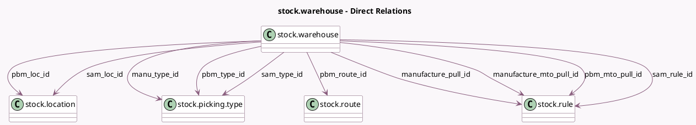

<!-- GENERATED:MODEL -->
---
tags: [odoo, community, generated, model]
---

# stock.warehouse

- Module: [[docs/Community Addons/mrp/mrp|mrp]]
- Scope: Community Addons
- Defined in module: extension only
- Source files: `models/stock_warehouse.py`
- Python classes: `StockWarehouse`

## Field footprint

- Detected fields: 12
- Field types: `Boolean` x 1, `Many2one` x 10, `Selection` x 1
- Relation fields: 10

## Sample fields

- `manu_type_id`: `Many2one` (comodel `stock.picking.type`)
- `manufacture_mto_pull_id`: `Many2one` (comodel `stock.rule`)
- `manufacture_pull_id`: `Many2one` (comodel `stock.rule`)
- `manufacture_steps`: `Selection`
- `manufacture_to_resupply`: `Boolean` (comodel `Manufacture to Resupply`, compute `_compute_manufacture_to_resupply`)
- `pbm_loc_id`: `Many2one` (comodel `stock.location`)
- `pbm_mto_pull_id`: `Many2one` (comodel `stock.rule`)
- `pbm_route_id`: `Many2one` (comodel `stock.route`)
- `pbm_type_id`: `Many2one` (comodel `stock.picking.type`)
- `sam_loc_id`: `Many2one` (comodel `stock.location`)
- `sam_rule_id`: `Many2one` (comodel `stock.rule`)
- `sam_type_id`: `Many2one` (comodel `stock.picking.type`)

## Method hints

- Detected methods: 17
- Action methods: none
- Compute methods: `_compute_manufacture_to_resupply`
- Onchange methods: none

## Direct relation diagram

## Navigation

- **Parent:** [[docs/Community Addons/mrp/Models]]

<!-- GENERATED:MODEL -->
