<!-- GENERATED:MODEL -->
---
tags: [odoo, community, generated, model]
---

# stock.warehouse.orderpoint

- Module: [[docs/Community Addons/mrp/mrp|mrp]]
- Scope: Community Addons
- Defined in module: extension only
- Source files: `models/stock_orderpoint.py`, `models/stock_warehouse.py`
- Python classes: `StockWarehouseOrderpoint`

## Field footprint

- Detected fields: 4
- Field types: `Boolean` x 1, `Char` x 1, `Many2one` x 2
- Relation fields: 2

## Sample fields

- `bom_id`: `Many2one` (comodel `mrp.bom`)
- `bom_id_placeholder`: `Char` (compute `_compute_bom_id_placeholder`)
- `effective_bom_id`: `Many2one` (comodel `mrp.bom`, compute `_compute_effective_bom_id`, store `False`)
- `show_bom`: `Boolean` (comodel `Show BoM column`, compute `_compute_show_bom`)

## Method hints

- Detected methods: 21
- Action methods: none
- Compute methods: `_compute_allowed_replenishment_uom_ids`, `_compute_bom_id_placeholder`, `_compute_days_to_order`, `_compute_deadline_date`, `_compute_effective_bom_id`, `_compute_qty_to_order_computed`, `_compute_show_bom`, `_compute_show_supply_warning`
- Onchange methods: none

## Direct relation diagram

```plantuml
@startuml
!define ODOO_COLOR_PRIMARY #714B67
!define ODOO_COLOR_ACCENT #875A7B
!define ODOO_COLOR_BG #FAF7FA

skinparam backgroundColor ODOO_COLOR_BG
skinparam defaultTextAlignment left
skinparam ArrowColor ODOO_COLOR_ACCENT
skinparam ClassBackgroundColor white
skinparam ClassBorderColor ODOO_COLOR_PRIMARY
skinparam ComponentBackgroundColor white
skinparam ComponentBorderColor ODOO_COLOR_PRIMARY
skinparam NoteBackgroundColor #FFF8FF
skinparam NoteBorderColor ODOO_COLOR_ACCENT
skinparam SequenceLifeLineBorderColor ODOO_COLOR_ACCENT
skinparam SequenceLifeLineBackgroundColor #FFFFFF
skinparam SequenceParticipantBorderColor ODOO_COLOR_PRIMARY
skinparam SequenceParticipantBackgroundColor #FFFFFF
skinparam sequence {
  ArrowColor ODOO_COLOR_ACCENT
  ActorBorderColor ODOO_COLOR_PRIMARY
}
title stock.warehouse.orderpoint - Direct Relations
class "stock.warehouse.orderpoint" as stock_warehouse_orderpoint
class "mrp.bom" as mrp_bom
stock_warehouse_orderpoint --> mrp_bom : bom_id
stock_warehouse_orderpoint --> mrp_bom : effective_bom_id
@enduml
```

## Navigation

- **Parent:** [[docs/Community Addons/mrp/Models]]

<!-- GENERATED:MODEL -->
