<!-- GENERATED:MODEL -->
---
tags: [odoo, community, generated, model]
---

# stock.warn.insufficient.qty.unbuild

- Module: [[docs/Community Addons/mrp/mrp|mrp]]
- Scope: Community Addons
- Defined in module: yes
- Source files: `wizard/stock_warn_insufficient_qty.py`
- Python classes: `StockWarnInsufficientQtyUnbuild`
- Description: Warn Insufficient Unbuild Quantity
- Inherits: `stock.warn.insufficient.qty`

## Field footprint

- Detected fields: 1
- Field types: `Many2one` x 1
- Relation fields: 1

## Sample fields

- `unbuild_id`: `Many2one` (comodel `mrp.unbuild`)

## Method hints

- Detected methods: 2
- Action methods: `action_done`
- Compute methods: none
- Onchange methods: none

## Direct relation diagram

```plantuml
@startuml
!define ODOO_COLOR_PRIMARY #714B67
!define ODOO_COLOR_ACCENT #875A7B
!define ODOO_COLOR_BG #FAF7FA

skinparam backgroundColor ODOO_COLOR_BG
skinparam defaultTextAlignment left
skinparam ArrowColor ODOO_COLOR_ACCENT
skinparam ClassBackgroundColor white
skinparam ClassBorderColor ODOO_COLOR_PRIMARY
skinparam ComponentBackgroundColor white
skinparam ComponentBorderColor ODOO_COLOR_PRIMARY
skinparam NoteBackgroundColor #FFF8FF
skinparam NoteBorderColor ODOO_COLOR_ACCENT
skinparam SequenceLifeLineBorderColor ODOO_COLOR_ACCENT
skinparam SequenceLifeLineBackgroundColor #FFFFFF
skinparam SequenceParticipantBorderColor ODOO_COLOR_PRIMARY
skinparam SequenceParticipantBackgroundColor #FFFFFF
skinparam sequence {
  ArrowColor ODOO_COLOR_ACCENT
  ActorBorderColor ODOO_COLOR_PRIMARY
}
title stock.warn.insufficient.qty.unbuild - Direct Relations
class "stock.warn.insufficient.qty.unbuild" as stock_warn_insufficient_qty_unbuild
class "mrp.unbuild" as mrp_unbuild
stock_warn_insufficient_qty_unbuild --> mrp_unbuild : unbuild_id
@enduml
```

## Navigation

- **Parent:** [[docs/Community Addons/mrp/Models]]

<!-- GENERATED:MODEL -->
