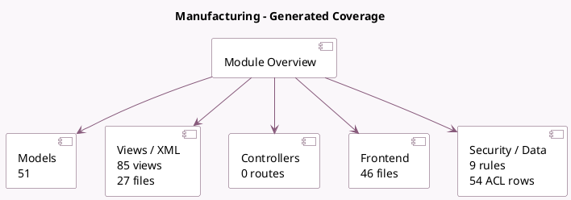

<!-- GENERATED:MODULE -->
---
tags: [odoo, community, module]
---

# Manufacturing

- Scope: Community Addons
- Source: odoo/addons/mrp
- Dependencies: [[docs/Community Addons/product/product|product]], [[docs/Community Addons/stock/stock|stock]], [[docs/Community Addons/resource/resource|resource]]

## Summary

Manufacturing Orders & BOMs

## Generated coverage

- Models: 51
- XML files with UI/data artifacts: 27
- Views: 85
- Actions: 61
- Menus: 21
- Rules (ir.rule): 9
- Access CSV entries: 54
- Controller units: 0
- Frontend asset files: 46

## Module map

## Detail notes

- Models: [[docs/Community Addons/mrp/Models|Models]] (51)
- Views and XML: [[docs/Community Addons/mrp/Views|Views]] (27 files)
- Frontend: [[docs/Community Addons/mrp/Frontend|Frontend]] (46 files)

## Key models

- `change.production.qty`
- `ir.attachment`
- `mrp.bom`
- `mrp.bom.byproduct`
- `mrp.bom.line`
- `mrp.consumption.warning`
- `mrp.consumption.warning.line`
- `mrp.production`
- `mrp.production.backorder`
- `mrp.production.backorder.line`
- `mrp.production.group`
- `mrp.production.serials`

## Navigation

- [[../Community Addons/Community Addons|Back to scope]]
- [[../../docs/docs|Back to docs]]

<!-- GENERATED:MODULE -->

