<!-- GENERATED:MODEL -->
---
tags: [odoo, community, generated, model]
---

# account.analytic.account

- Module: [[docs/Community Addons/mrp_account/mrp_account|mrp_account]]
- Scope: Community Addons
- Defined in module: extension only
- Source files: `models/analytic_account.py`
- Python classes: `AccountAnalyticAccount`
- Description: Analytic Account

## Field footprint

- Detected fields: 6
- Field types: `Integer` x 3, `Many2many` x 3
- Relation fields: 3

## Sample fields

- `bom_count`: `Integer` (comodel `BoM Count`, compute `_compute_bom_count`)
- `bom_ids`: `Many2many` (comodel `mrp.bom`)
- `production_count`: `Integer` (comodel `Manufacturing Orders Count`, compute `_compute_production_count`)
- `production_ids`: `Many2many` (comodel `mrp.production`)
- `workcenter_ids`: `Many2many` (comodel `mrp.workcenter`)
- `workorder_count`: `Integer` (comodel `Work Order Count`, compute `_compute_workorder_count`)

## Method hints

- Detected methods: 6
- Action methods: `action_view_mrp_bom`, `action_view_mrp_production`, `action_view_workorder`
- Compute methods: `_compute_bom_count`, `_compute_production_count`, `_compute_workorder_count`
- Onchange methods: none

## Direct relation diagram

```plantuml
@startuml
!define ODOO_COLOR_PRIMARY #714B67
!define ODOO_COLOR_ACCENT #875A7B
!define ODOO_COLOR_BG #FAF7FA

skinparam backgroundColor ODOO_COLOR_BG
skinparam defaultTextAlignment left
skinparam ArrowColor ODOO_COLOR_ACCENT
skinparam ClassBackgroundColor white
skinparam ClassBorderColor ODOO_COLOR_PRIMARY
skinparam ComponentBackgroundColor white
skinparam ComponentBorderColor ODOO_COLOR_PRIMARY
skinparam NoteBackgroundColor #FFF8FF
skinparam NoteBorderColor ODOO_COLOR_ACCENT
skinparam SequenceLifeLineBorderColor ODOO_COLOR_ACCENT
skinparam SequenceLifeLineBackgroundColor #FFFFFF
skinparam SequenceParticipantBorderColor ODOO_COLOR_PRIMARY
skinparam SequenceParticipantBackgroundColor #FFFFFF
skinparam sequence {
  ArrowColor ODOO_COLOR_ACCENT
  ActorBorderColor ODOO_COLOR_PRIMARY
}
title account.analytic.account - Direct Relations
class "account.analytic.account" as account_analytic_account
class "mrp.bom" as mrp_bom
class "mrp.production" as mrp_production
class "mrp.workcenter" as mrp_workcenter
account_analytic_account .. mrp_production : production_ids
account_analytic_account .. mrp_bom : bom_ids
account_analytic_account .. mrp_workcenter : workcenter_ids
@enduml
```

## Navigation

- **Parent:** [[docs/Community Addons/mrp_account/Models]]

<!-- GENERATED:MODEL -->
