<!-- GENERATED:MODEL -->
---
tags: [odoo, community, generated, model]
---

# mrp.account.wip.accounting.line

- Module: [[docs/Community Addons/mrp_account/mrp_account|mrp_account]]
- Scope: Community Addons
- Defined in module: yes
- Source files: `wizard/mrp_wip_accounting.py`
- Python classes: `MrpAccountWipAccountingLine`
- Description: Account move line to be created when posting WIP account move

## Field footprint

- Detected fields: 6
- Field types: `Char` x 1, `Many2one` x 3, `Monetary` x 2
- Relation fields: 3

## Sample fields

- `account_id`: `Many2one` (comodel `account.account`)
- `credit`: `Monetary` (comodel `Credit`, compute `_compute_credit`, store `True`)
- `currency_id`: `Many2one` (comodel `res.currency`)
- `debit`: `Monetary` (comodel `Debit`, compute `_compute_debit`, store `True`)
- `label`: `Char` (comodel `Label`)
- `wip_accounting_id`: `Many2one` (comodel `mrp.account.wip.accounting`)

## Method hints

- Detected methods: 2
- Action methods: none
- Compute methods: `_compute_credit`, `_compute_debit`
- Onchange methods: none

## Direct relation diagram

```plantuml
@startuml
!define ODOO_COLOR_PRIMARY #714B67
!define ODOO_COLOR_ACCENT #875A7B
!define ODOO_COLOR_BG #FAF7FA

skinparam backgroundColor ODOO_COLOR_BG
skinparam defaultTextAlignment left
skinparam ArrowColor ODOO_COLOR_ACCENT
skinparam ClassBackgroundColor white
skinparam ClassBorderColor ODOO_COLOR_PRIMARY
skinparam ComponentBackgroundColor white
skinparam ComponentBorderColor ODOO_COLOR_PRIMARY
skinparam NoteBackgroundColor #FFF8FF
skinparam NoteBorderColor ODOO_COLOR_ACCENT
skinparam SequenceLifeLineBorderColor ODOO_COLOR_ACCENT
skinparam SequenceLifeLineBackgroundColor #FFFFFF
skinparam SequenceParticipantBorderColor ODOO_COLOR_PRIMARY
skinparam SequenceParticipantBackgroundColor #FFFFFF
skinparam sequence {
  ArrowColor ODOO_COLOR_ACCENT
  ActorBorderColor ODOO_COLOR_PRIMARY
}
title mrp.account.wip.accounting.line - Direct Relations
class "mrp.account.wip.accounting.line" as mrp_account_wip_accounting_line
class "account.account" as account_account
class "mrp.account.wip.accounting" as mrp_account_wip_accounting
class "res.currency" as res_currency
mrp_account_wip_accounting_line --> account_account : account_id
mrp_account_wip_accounting_line --> res_currency : currency_id
mrp_account_wip_accounting_line --> mrp_account_wip_accounting : wip_accounting_id
@enduml
```

## Navigation

- **Parent:** [[docs/Community Addons/mrp_account/Models]]

<!-- GENERATED:MODEL -->
