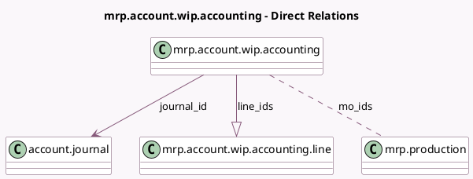

<!-- GENERATED:MODEL -->
---
tags: [odoo, community, generated, model]
---

# mrp.account.wip.accounting

- Module: [[docs/Community Addons/mrp_account/mrp_account|mrp_account]]
- Scope: Community Addons
- Defined in module: yes
- Source files: `wizard/mrp_wip_accounting.py`
- Python classes: `MrpAccountWipAccounting`
- Description: Wizard to post Manufacturing WIP account move

## Field footprint

- Detected fields: 6
- Field types: `Char` x 1, `Date` x 2, `Many2many` x 1, `Many2one` x 1, `One2many` x 1
- Relation fields: 3

## Sample fields

- `date`: `Date` (comodel `Date`)
- `journal_id`: `Many2one` (comodel `account.journal`)
- `line_ids`: `One2many` (comodel `mrp.account.wip.accounting.line`, compute `_compute_line_ids`, store `True`)
- `mo_ids`: `Many2many` (comodel `mrp.production`)
- `reference`: `Char` (comodel `Reference`)
- `reversal_date`: `Date` (comodel `Reversal Date`, compute `_compute_reversal_date`, store `True`)

## Method hints

- Detected methods: 6
- Action methods: none
- Compute methods: `_compute_line_ids`, `_compute_reversal_date`
- Onchange methods: none

## Direct relation diagram

## Navigation

- **Parent:** [[docs/Community Addons/mrp_account/Models]]

<!-- GENERATED:MODEL -->
