<!-- GENERATED:MODEL -->
---
tags: [odoo, community, generated, model]
---

# mrp.production

- Module: [[docs/Community Addons/mrp_account/mrp_account|mrp_account]]
- Scope: Community Addons
- Defined in module: extension only
- Source files: `models/mrp_production.py`
- Python classes: `MrpProduction`

## Field footprint

- Detected fields: 4
- Field types: `Boolean` x 1, `Float` x 1, `Integer` x 1, `Many2many` x 1
- Relation fields: 1

## Sample fields

- `extra_cost`: `Float`
- `show_valuation`: `Boolean` (compute `_compute_show_valuation`)
- `wip_move_count`: `Integer` (comodel `WIP Journal Entry Count`, compute `_compute_wip_move_count`)
- `wip_move_ids`: `Many2many` (comodel `account.move`)

## Method hints

- Detected methods: 6
- Action methods: `action_view_move_wip`
- Compute methods: `_compute_show_valuation`, `_compute_wip_move_count`
- Onchange methods: none

## Direct relation diagram

```plantuml
@startuml
!define ODOO_COLOR_PRIMARY #714B67
!define ODOO_COLOR_ACCENT #875A7B
!define ODOO_COLOR_BG #FAF7FA

skinparam backgroundColor ODOO_COLOR_BG
skinparam defaultTextAlignment left
skinparam ArrowColor ODOO_COLOR_ACCENT
skinparam ClassBackgroundColor white
skinparam ClassBorderColor ODOO_COLOR_PRIMARY
skinparam ComponentBackgroundColor white
skinparam ComponentBorderColor ODOO_COLOR_PRIMARY
skinparam NoteBackgroundColor #FFF8FF
skinparam NoteBorderColor ODOO_COLOR_ACCENT
skinparam SequenceLifeLineBorderColor ODOO_COLOR_ACCENT
skinparam SequenceLifeLineBackgroundColor #FFFFFF
skinparam SequenceParticipantBorderColor ODOO_COLOR_PRIMARY
skinparam SequenceParticipantBackgroundColor #FFFFFF
skinparam sequence {
  ArrowColor ODOO_COLOR_ACCENT
  ActorBorderColor ODOO_COLOR_PRIMARY
}
title mrp.production - Direct Relations
class "mrp.production" as mrp_production
class "account.move" as account_move
mrp_production .. account_move : wip_move_ids
@enduml
```

## Navigation

- **Parent:** [[docs/Community Addons/mrp_account/Models]]

<!-- GENERATED:MODEL -->
