<!-- GENERATED:MODEL -->
---
tags: [odoo, community, generated, model]
---

# mrp.workcenter

- Module: [[docs/Community Addons/mrp_account/mrp_account|mrp_account]]
- Scope: Community Addons
- Defined in module: yes
- Source files: `models/mrp_workcenter.py`
- Python classes: `MrpWorkcenter`
- Inherits: `analytic.mixin`

## Field footprint

- Detected fields: 2
- Field types: `Many2many` x 1, `Many2one` x 1
- Relation fields: 2

## Sample fields

- `costs_hour_account_ids`: `Many2many` (comodel `account.analytic.account`, compute `_compute_costs_hour_account_ids`, store `True`)
- `expense_account_id`: `Many2one` (comodel `account.account`)

## Method hints

- Detected methods: 1
- Action methods: none
- Compute methods: `_compute_costs_hour_account_ids`
- Onchange methods: none

## Direct relation diagram

```plantuml
@startuml
!define ODOO_COLOR_PRIMARY #714B67
!define ODOO_COLOR_ACCENT #875A7B
!define ODOO_COLOR_BG #FAF7FA

skinparam backgroundColor ODOO_COLOR_BG
skinparam defaultTextAlignment left
skinparam ArrowColor ODOO_COLOR_ACCENT
skinparam ClassBackgroundColor white
skinparam ClassBorderColor ODOO_COLOR_PRIMARY
skinparam ComponentBackgroundColor white
skinparam ComponentBorderColor ODOO_COLOR_PRIMARY
skinparam NoteBackgroundColor #FFF8FF
skinparam NoteBorderColor ODOO_COLOR_ACCENT
skinparam SequenceLifeLineBorderColor ODOO_COLOR_ACCENT
skinparam SequenceLifeLineBackgroundColor #FFFFFF
skinparam SequenceParticipantBorderColor ODOO_COLOR_PRIMARY
skinparam SequenceParticipantBackgroundColor #FFFFFF
skinparam sequence {
  ArrowColor ODOO_COLOR_ACCENT
  ActorBorderColor ODOO_COLOR_PRIMARY
}
title mrp.workcenter - Direct Relations
class "mrp.workcenter" as mrp_workcenter
class "account.account" as account_account
class "account.analytic.account" as account_analytic_account
mrp_workcenter .. account_analytic_account : costs_hour_account_ids
mrp_workcenter --> account_account : expense_account_id
@enduml
```

## Navigation

- **Parent:** [[docs/Community Addons/mrp_account/Models]]

<!-- GENERATED:MODEL -->
