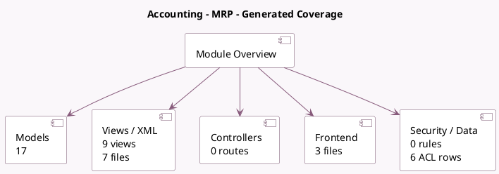

<!-- GENERATED:MODULE -->
---
tags: [odoo, community, module]
---

# Accounting - MRP

- Scope: Community Addons
- Source: odoo/addons/mrp_account
- Dependencies: [[docs/Community Addons/mrp/mrp|mrp]], [[docs/Community Addons/stock_account/stock_account|stock_account]]

## Summary

Analytic accounting in Manufacturing

## Generated coverage

- Models: 17
- XML files with UI/data artifacts: 7
- Views: 9
- Actions: 4
- Menus: 0
- Rules (ir.rule): 0
- Access CSV entries: 6
- Controller units: 0
- Frontend asset files: 3

## Module map

## Detail notes

- Models: [[docs/Community Addons/mrp_account/Models|Models]] (17)
- Views and XML: [[docs/Community Addons/mrp_account/Views|Views]] (7 files)
- Frontend: [[docs/Community Addons/mrp_account/Frontend|Frontend]] (3 files)

## Key models

- `account.analytic.account`
- `account.analytic.applicability`
- `account.analytic.line`
- `account.move`
- `account.move.line`
- `mrp.account.wip.accounting`
- `mrp.account.wip.accounting.line`
- `mrp.production`
- `mrp.workcenter`
- `mrp.workcenter.productivity`
- `mrp.workorder`
- `product.category`

## Navigation

- [[../Community Addons/Community Addons|Back to scope]]
- [[../../docs/docs|Back to docs]]

<!-- GENERATED:MODULE -->

