<!-- GENERATED:MODEL -->
---
tags: [odoo, community, generated, model]
---

# expiry.picking.confirmation

- Module: [[docs/Community Addons/mrp_product_expiry/mrp_product_expiry|mrp_product_expiry]]
- Scope: Community Addons
- Defined in module: extension only
- Source files: `wizard/confirm_expiry.py`
- Python classes: `ExpiryPickingConfirmation`

## Field footprint

- Detected fields: 2
- Field types: `Many2many` x 1, `Many2one` x 1
- Relation fields: 2

## Sample fields

- `production_ids`: `Many2many` (comodel `mrp.production`)
- `workorder_id`: `Many2one` (comodel `mrp.workorder`)

## Method hints

- Detected methods: 3
- Action methods: none
- Compute methods: `_compute_descriptive_fields`
- Onchange methods: none

## Direct relation diagram

```plantuml
@startuml
!define ODOO_COLOR_PRIMARY #714B67
!define ODOO_COLOR_ACCENT #875A7B
!define ODOO_COLOR_BG #FAF7FA

skinparam backgroundColor ODOO_COLOR_BG
skinparam defaultTextAlignment left
skinparam ArrowColor ODOO_COLOR_ACCENT
skinparam ClassBackgroundColor white
skinparam ClassBorderColor ODOO_COLOR_PRIMARY
skinparam ComponentBackgroundColor white
skinparam ComponentBorderColor ODOO_COLOR_PRIMARY
skinparam NoteBackgroundColor #FFF8FF
skinparam NoteBorderColor ODOO_COLOR_ACCENT
skinparam SequenceLifeLineBorderColor ODOO_COLOR_ACCENT
skinparam SequenceLifeLineBackgroundColor #FFFFFF
skinparam SequenceParticipantBorderColor ODOO_COLOR_PRIMARY
skinparam SequenceParticipantBackgroundColor #FFFFFF
skinparam sequence {
  ArrowColor ODOO_COLOR_ACCENT
  ActorBorderColor ODOO_COLOR_PRIMARY
}
title expiry.picking.confirmation - Direct Relations
class "expiry.picking.confirmation" as expiry_picking_confirmation
class "mrp.production" as mrp_production
class "mrp.workorder" as mrp_workorder
expiry_picking_confirmation .. mrp_production : production_ids
expiry_picking_confirmation --> mrp_workorder : workorder_id
@enduml
```

## Navigation

- **Parent:** [[docs/Community Addons/mrp_product_expiry/Models]]

<!-- GENERATED:MODEL -->
