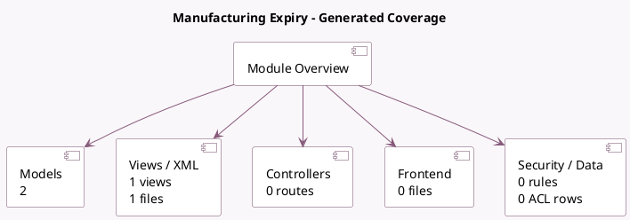

<!-- GENERATED:MODULE -->
---
tags: [odoo, community, module]
---

# Manufacturing Expiry

- Scope: Community Addons
- Source: odoo/addons/mrp_product_expiry
- Dependencies: [[docs/Community Addons/mrp/mrp|mrp]], [[docs/Community Addons/product_expiry/product_expiry|product_expiry]]

## Summary

Manufacturing Expiry

## Generated coverage

- Models: 2
- XML files with UI/data artifacts: 1
- Views: 1
- Actions: 0
- Menus: 0
- Rules (ir.rule): 0
- Access CSV entries: 0
- Controller units: 0
- Frontend asset files: 0

## Module map

## Detail notes

- Models: [[docs/Community Addons/mrp_product_expiry/Models|Models]] (2)
- Views and XML: [[docs/Community Addons/mrp_product_expiry/Views|Views]] (1 files)

## Key models

- `expiry.picking.confirmation`
- `mrp.production`

## Navigation

- [[../Community Addons/Community Addons|Back to scope]]
- [[../../docs/docs|Back to docs]]

<!-- GENERATED:MODULE -->

