<!-- GENERATED:MODEL -->
---
tags: [odoo, community, generated, model]
---

# mrp.production

- Module: [[docs/Community Addons/mrp_subcontracting/mrp_subcontracting|mrp_subcontracting]]
- Scope: Community Addons
- Defined in module: extension only
- Source files: `models/mrp_production.py`
- Python classes: `MrpProduction`

## Field footprint

- Detected fields: 5
- Field types: `Boolean` x 1, `Many2many` x 1, `Many2one` x 2, `One2many` x 1
- Relation fields: 4

## Sample fields

- `bom_product_ids`: `Many2many` (comodel `product.product`, compute `_compute_bom_product_ids`)
- `incoming_picking`: `Many2one` (related `move_finished_ids.move_dest_ids.picking_id`)
- `move_line_raw_ids`: `One2many` (comodel `stock.move.line`, compute `_compute_move_line_raw_ids`)
- `subcontracting_has_been_recorded`: `Boolean` (comodel `Has been recorded?`)
- `subcontractor_id`: `Many2one` (comodel `res.partner`)

## Method hints

- Detected methods: 12
- Action methods: `action_merge`, `action_split_subcontracting`
- Compute methods: `_compute_bom_product_ids`, `_compute_move_line_raw_ids`
- Onchange methods: none

## Direct relation diagram

```plantuml
@startuml
!define ODOO_COLOR_PRIMARY #714B67
!define ODOO_COLOR_ACCENT #875A7B
!define ODOO_COLOR_BG #FAF7FA

skinparam backgroundColor ODOO_COLOR_BG
skinparam defaultTextAlignment left
skinparam ArrowColor ODOO_COLOR_ACCENT
skinparam ClassBackgroundColor white
skinparam ClassBorderColor ODOO_COLOR_PRIMARY
skinparam ComponentBackgroundColor white
skinparam ComponentBorderColor ODOO_COLOR_PRIMARY
skinparam NoteBackgroundColor #FFF8FF
skinparam NoteBorderColor ODOO_COLOR_ACCENT
skinparam SequenceLifeLineBorderColor ODOO_COLOR_ACCENT
skinparam SequenceLifeLineBackgroundColor #FFFFFF
skinparam SequenceParticipantBorderColor ODOO_COLOR_PRIMARY
skinparam SequenceParticipantBackgroundColor #FFFFFF
skinparam sequence {
  ArrowColor ODOO_COLOR_ACCENT
  ActorBorderColor ODOO_COLOR_PRIMARY
}
title mrp.production - Direct Relations
class "mrp.production" as mrp_production
class "product.product" as product_product
class "res.partner" as res_partner
class "stock.move.line" as stock_move_line
mrp_production --|> stock_move_line : move_line_raw_ids
mrp_production --> res_partner : subcontractor_id
mrp_production .. product_product : bom_product_ids
@enduml
```

## Navigation

- **Parent:** [[docs/Community Addons/mrp_subcontracting/Models]]

<!-- GENERATED:MODEL -->
