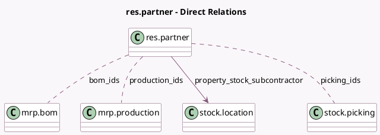

<!-- GENERATED:MODEL -->
---
tags: [odoo, community, generated, model]
---

# res.partner

- Module: [[docs/Community Addons/mrp_subcontracting/mrp_subcontracting|mrp_subcontracting]]
- Scope: Community Addons
- Defined in module: extension only
- Source files: `models/res_partner.py`
- Python classes: `ResPartner`

## Field footprint

- Detected fields: 5
- Field types: `Boolean` x 1, `Many2many` x 3, `Many2one` x 1
- Relation fields: 4

## Sample fields

- `bom_ids`: `Many2many` (comodel `mrp.bom`, compute `_compute_bom_ids`)
- `is_subcontractor`: `Boolean` (compute `_compute_is_subcontractor`, store `False`)
- `picking_ids`: `Many2many` (comodel `stock.picking`, compute `_compute_picking_ids`)
- `production_ids`: `Many2many` (comodel `mrp.production`, compute `_compute_production_ids`)
- `property_stock_subcontractor`: `Many2one` (comodel `stock.location`)

## Method hints

- Detected methods: 5
- Action methods: none
- Compute methods: `_compute_bom_ids`, `_compute_is_subcontractor`, `_compute_picking_ids`, `_compute_production_ids`
- Onchange methods: none

## Direct relation diagram

## Navigation

- **Parent:** [[docs/Community Addons/mrp_subcontracting/Models]]

<!-- GENERATED:MODEL -->
