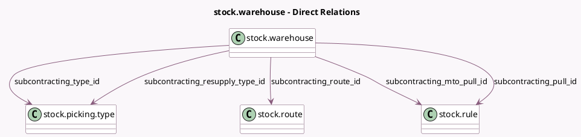

<!-- GENERATED:MODEL -->
---
tags: [odoo, community, generated, model]
---

# stock.warehouse

- Module: [[docs/Community Addons/mrp_subcontracting/mrp_subcontracting|mrp_subcontracting]]
- Scope: Community Addons
- Defined in module: extension only
- Source files: `models/stock_warehouse.py`
- Python classes: `StockWarehouse`

## Field footprint

- Detected fields: 6
- Field types: `Boolean` x 1, `Many2one` x 5
- Relation fields: 5

## Sample fields

- `subcontracting_mto_pull_id`: `Many2one` (comodel `stock.rule`)
- `subcontracting_pull_id`: `Many2one` (comodel `stock.rule`)
- `subcontracting_resupply_type_id`: `Many2one` (comodel `stock.picking.type`)
- `subcontracting_route_id`: `Many2one` (comodel `stock.route`)
- `subcontracting_to_resupply`: `Boolean` (comodel `Resupply Subcontractors`)
- `subcontracting_type_id`: `Many2one` (comodel `stock.picking.type`)

## Method hints

- Detected methods: 12
- Action methods: none
- Compute methods: none
- Onchange methods: none

## Direct relation diagram

## Navigation

- **Parent:** [[docs/Community Addons/mrp_subcontracting/Models]]

<!-- GENERATED:MODEL -->
