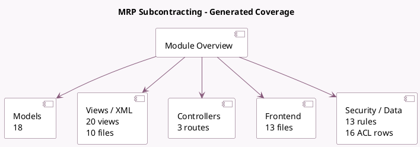

<!-- GENERATED:MODULE -->
---
tags: [odoo, community, module]
---

# MRP Subcontracting

- Scope: Community Addons
- Source: odoo/addons/mrp_subcontracting
- Dependencies: [[docs/Community Addons/mrp/mrp|mrp]]

## Summary

Subcontract Productions

## Generated coverage

- Models: 18
- XML files with UI/data artifacts: 10
- Views: 20
- Actions: 1
- Menus: 0
- Rules (ir.rule): 13
- Access CSV entries: 16
- Controller units: 1
- Frontend asset files: 13

## Module map

## Detail notes

- Models: [[docs/Community Addons/mrp_subcontracting/Models|Models]] (18)
- Views and XML: [[docs/Community Addons/mrp_subcontracting/Views|Views]] (10 files)
- Controllers: [[docs/Community Addons/mrp_subcontracting/Controllers|Controllers]] (1)
- Frontend: [[docs/Community Addons/mrp_subcontracting/Frontend|Frontend]] (13 files)

## Key models

- `change.production.qty`
- `mrp.bom`
- `mrp.production`
- `mrp.production.serials`
- `product.product`
- `product.supplierinfo`
- `report.mrp.report_bom_structure`
- `res.company`
- `res.partner`
- `stock.location`
- `stock.move`
- `stock.move.line`

## Navigation

- [[../Community Addons/Community Addons|Back to scope]]
- [[../../docs/docs|Back to docs]]

<!-- GENERATED:MODULE -->

