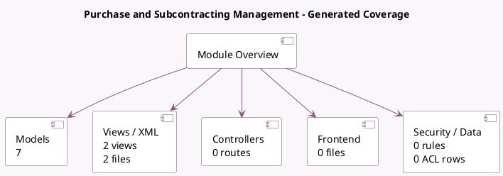

<!-- GENERATED:MODULE -->
---
tags: [odoo, community, module]
---

# Purchase and Subcontracting Management

- Scope: Community Addons
- Source: odoo/addons/mrp_subcontracting_purchase
- Dependencies: [[docs/Community Addons/mrp_subcontracting/mrp_subcontracting|mrp_subcontracting]], [[docs/Community Addons/purchase_mrp/purchase_mrp|purchase_mrp]]

## Generated coverage

- Models: 7
- XML files with UI/data artifacts: 2
- Views: 2
- Actions: 0
- Menus: 0
- Rules (ir.rule): 0
- Access CSV entries: 0
- Controller units: 0
- Frontend asset files: 0

## Module map

## Detail notes

- Models: [[docs/Community Addons/mrp_subcontracting_purchase/Models|Models]] (7)
- Views and XML: [[docs/Community Addons/mrp_subcontracting_purchase/Views|Views]] (2 files)

## Key models

- `account.move.line`
- `product.product`
- `purchase.order`
- `report.mrp.report_bom_structure`
- `stock.move`
- `stock.picking`
- `stock.rule`

## Navigation

- [[../Community Addons/Community Addons|Back to scope]]
- [[../../docs/docs|Back to docs]]

<!-- GENERATED:MODULE -->

