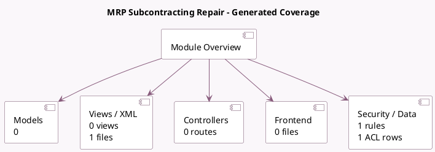

<!-- GENERATED:MODULE -->
---
tags: [odoo, community, module]
---

# MRP Subcontracting Repair

- Scope: Community Addons
- Source: odoo/addons/mrp_subcontracting_repair
- Dependencies: [[docs/Community Addons/mrp_subcontracting/mrp_subcontracting|mrp_subcontracting]], [[docs/Community Addons/repair/repair|repair]]

## Generated coverage

- Models: 0
- XML files with UI/data artifacts: 1
- Views: 0
- Actions: 0
- Menus: 0
- Rules (ir.rule): 1
- Access CSV entries: 1
- Controller units: 0
- Frontend asset files: 0

## Module map

## Detail notes

- Views and XML: [[docs/Community Addons/mrp_subcontracting_repair/Views|Views]] (1 files)

## Navigation

- [[../Community Addons/Community Addons|Back to scope]]
- [[../../docs/docs|Back to docs]]

<!-- GENERATED:MODULE -->

