<!-- GENERATED:MODEL -->
---
tags: [odoo, community, generated, model]
---

# onboarding.onboarding

- Module: [[docs/Community Addons/onboarding/onboarding|onboarding]]
- Scope: Community Addons
- Defined in module: yes
- Source files: `models/onboarding_onboarding.py`
- Python classes: `OnboardingOnboarding`
- Description: Onboarding

## Field footprint

- Detected fields: 11
- Field types: `Boolean` x 2, `Char` x 4, `Integer` x 1, `Many2many` x 1, `Many2one` x 1, `One2many` x 1, `Selection` x 1
- Relation fields: 3

## Sample fields

- `current_onboarding_state`: `Selection` (compute `_compute_current_progress`)
- `current_progress_id`: `Many2one` (comodel `onboarding.progress`, compute `_compute_current_progress`)
- `is_onboarding_closed`: `Boolean` (compute `_compute_current_progress`)
- `is_per_company`: `Boolean` (comodel `Should be done per company?`, compute `_compute_is_per_company`, store `False`)
- `name`: `Char` (comodel `Name of the onboarding`)
- `panel_close_action_name`: `Char` (comodel `Closing action`)
- `progress_ids`: `One2many` (comodel `onboarding.progress`)
- `route_name`: `Char` (comodel `One word name`)
- `sequence`: `Integer`
- `step_ids`: `Many2many` (comodel `onboarding.onboarding.step`)
- `text_completed`: `Char` (comodel `Message at completion`)

## Method hints

- Detected methods: 10
- Action methods: `action_close`, `action_close_panel`, `action_refresh_progress_ids`, `action_toggle_visibility`
- Compute methods: `_compute_current_progress`, `_compute_is_per_company`
- Onchange methods: none

## Direct relation diagram

```plantuml
@startuml
!define ODOO_COLOR_PRIMARY #714B67
!define ODOO_COLOR_ACCENT #875A7B
!define ODOO_COLOR_BG #FAF7FA

skinparam backgroundColor ODOO_COLOR_BG
skinparam defaultTextAlignment left
skinparam ArrowColor ODOO_COLOR_ACCENT
skinparam ClassBackgroundColor white
skinparam ClassBorderColor ODOO_COLOR_PRIMARY
skinparam ComponentBackgroundColor white
skinparam ComponentBorderColor ODOO_COLOR_PRIMARY
skinparam NoteBackgroundColor #FFF8FF
skinparam NoteBorderColor ODOO_COLOR_ACCENT
skinparam SequenceLifeLineBorderColor ODOO_COLOR_ACCENT
skinparam SequenceLifeLineBackgroundColor #FFFFFF
skinparam SequenceParticipantBorderColor ODOO_COLOR_PRIMARY
skinparam SequenceParticipantBackgroundColor #FFFFFF
skinparam sequence {
  ArrowColor ODOO_COLOR_ACCENT
  ActorBorderColor ODOO_COLOR_PRIMARY
}
title onboarding.onboarding - Direct Relations
class "onboarding.onboarding" as onboarding_onboarding
class "onboarding.onboarding.step" as onboarding_onboarding_step
class "onboarding.progress" as onboarding_progress
onboarding_onboarding .. onboarding_onboarding_step : step_ids
onboarding_onboarding --> onboarding_progress : current_progress_id
onboarding_onboarding --|> onboarding_progress : progress_ids
@enduml
```

## Navigation

- **Parent:** [[docs/Community Addons/onboarding/Models]]

<!-- GENERATED:MODEL -->
