<!-- GENERATED:MODEL -->
---
tags: [odoo, community, generated, model]
---

# onboarding.onboarding.step

- Module: [[docs/Community Addons/onboarding/onboarding|onboarding]]
- Scope: Community Addons
- Defined in module: yes
- Source files: `models/onboarding_onboarding_step.py`
- Python classes: `OnboardingOnboardingStep`
- Description: Onboarding Step

## Field footprint

- Detected fields: 15
- Field types: `Binary` x 1, `Boolean` x 1, `Char` x 8, `Integer` x 1, `Many2many` x 1, `Many2one` x 1, `One2many` x 1, `Selection` x 1
- Relation fields: 3

## Sample fields

- `button_text`: `Char` (comodel `Button text`)
- `current_progress_step_id`: `Many2one` (comodel `onboarding.progress.step`, compute `_compute_current_progress`)
- `current_step_state`: `Selection` (compute `_compute_current_progress`)
- `description`: `Char` (comodel `Description`)
- `done_icon`: `Char` (comodel `Font Awesome Icon when completed`)
- `done_text`: `Char` (comodel `Text to show when step is completed`)
- `is_per_company`: `Boolean` (comodel `Is per company`)
- `onboarding_ids`: `Many2many` (comodel `onboarding.onboarding`)
- `panel_step_open_action_name`: `Char`
- `progress_ids`: `One2many` (comodel `onboarding.progress.step`)
- `sequence`: `Integer`
- `step_image`: `Binary` (comodel `Step Image`)
- `step_image_alt`: `Char` (comodel `Alt Text for the Step Image`)
- `step_image_filename`: `Char` (comodel `Step Image Filename`)
- `title`: `Char` (comodel `Title`)

## Method hints

- Detected methods: 7
- Action methods: `action_set_just_done`, `action_validate_step`
- Compute methods: `_compute_current_progress`
- Onchange methods: none

## Direct relation diagram

```plantuml
@startuml
!define ODOO_COLOR_PRIMARY #714B67
!define ODOO_COLOR_ACCENT #875A7B
!define ODOO_COLOR_BG #FAF7FA

skinparam backgroundColor ODOO_COLOR_BG
skinparam defaultTextAlignment left
skinparam ArrowColor ODOO_COLOR_ACCENT
skinparam ClassBackgroundColor white
skinparam ClassBorderColor ODOO_COLOR_PRIMARY
skinparam ComponentBackgroundColor white
skinparam ComponentBorderColor ODOO_COLOR_PRIMARY
skinparam NoteBackgroundColor #FFF8FF
skinparam NoteBorderColor ODOO_COLOR_ACCENT
skinparam SequenceLifeLineBorderColor ODOO_COLOR_ACCENT
skinparam SequenceLifeLineBackgroundColor #FFFFFF
skinparam SequenceParticipantBorderColor ODOO_COLOR_PRIMARY
skinparam SequenceParticipantBackgroundColor #FFFFFF
skinparam sequence {
  ArrowColor ODOO_COLOR_ACCENT
  ActorBorderColor ODOO_COLOR_PRIMARY
}
title onboarding.onboarding.step - Direct Relations
class "onboarding.onboarding.step" as onboarding_onboarding_step
class "onboarding.onboarding" as onboarding_onboarding
class "onboarding.progress.step" as onboarding_progress_step
onboarding_onboarding_step .. onboarding_onboarding : onboarding_ids
onboarding_onboarding_step --> onboarding_progress_step : current_progress_step_id
onboarding_onboarding_step --|> onboarding_progress_step : progress_ids
@enduml
```

## Navigation

- **Parent:** [[docs/Community Addons/onboarding/Models]]

<!-- GENERATED:MODEL -->
