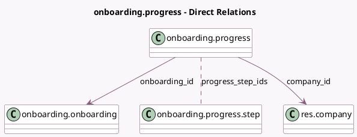

<!-- GENERATED:MODEL -->
---
tags: [odoo, community, generated, model]
---

# onboarding.progress

- Module: [[docs/Community Addons/onboarding/onboarding|onboarding]]
- Scope: Community Addons
- Defined in module: yes
- Source files: `models/onboarding_progress.py`
- Python classes: `OnboardingProgress`
- Description: Onboarding Progress Tracker

## Field footprint

- Detected fields: 5
- Field types: `Boolean` x 1, `Many2many` x 1, `Many2one` x 2, `Selection` x 1
- Relation fields: 3

## Sample fields

- `company_id`: `Many2one` (comodel `res.company`)
- `is_onboarding_closed`: `Boolean` (comodel `Was panel closed?`)
- `onboarding_id`: `Many2one` (comodel `onboarding.onboarding`)
- `onboarding_state`: `Selection` (compute `_compute_onboarding_state`, store `True`)
- `progress_step_ids`: `Many2many` (comodel `onboarding.progress.step`)

## Method hints

- Detected methods: 5
- Action methods: `action_close`, `action_toggle_visibility`
- Compute methods: `_compute_onboarding_state`
- Onchange methods: none

## Direct relation diagram

## Navigation

- **Parent:** [[docs/Community Addons/onboarding/Models]]

<!-- GENERATED:MODEL -->
