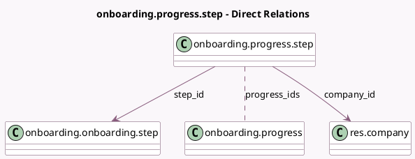

<!-- GENERATED:MODEL -->
---
tags: [odoo, community, generated, model]
---

# onboarding.progress.step

- Module: [[docs/Community Addons/onboarding/onboarding|onboarding]]
- Scope: Community Addons
- Defined in module: yes
- Source files: `models/onboarding_progress_step.py`
- Python classes: `OnboardingProgressStep`
- Description: Onboarding Progress Step Tracker

## Field footprint

- Detected fields: 4
- Field types: `Many2many` x 1, `Many2one` x 2, `Selection` x 1
- Relation fields: 3

## Sample fields

- `company_id`: `Many2one` (comodel `res.company`)
- `progress_ids`: `Many2many` (comodel `onboarding.progress`)
- `step_id`: `Many2one` (comodel `onboarding.onboarding.step`)
- `step_state`: `Selection`

## Method hints

- Detected methods: 2
- Action methods: `action_consolidate_just_done`, `action_set_just_done`
- Compute methods: none
- Onchange methods: none

## Direct relation diagram

## Navigation

- **Parent:** [[docs/Community Addons/onboarding/Models]]

<!-- GENERATED:MODEL -->
