<!-- GENERATED:MODEL -->
---
tags: [odoo, community, generated, model]
---

# res.partner.grade

- Module: [[docs/Community Addons/partnership/partnership|partnership]]
- Scope: Community Addons
- Defined in module: yes
- Source files: `models/res_partner_grade.py`
- Python classes: `ResPartnerGrade`
- Description: Partner Grade

## Field footprint

- Detected fields: 7
- Field types: `Boolean` x 1, `Char` x 2, `Integer` x 2, `Many2one` x 2
- Relation fields: 2

## Sample fields

- `active`: `Boolean`
- `company_id`: `Many2one` (comodel `res.company`)
- `default_pricelist_id`: `Many2one` (comodel `product.pricelist`)
- `name`: `Char` (comodel `Level Name`)
- `partners_count`: `Integer` (compute `_compute_partners_count`)
- `partners_label`: `Char` (related `company_id.partnership_label`)
- `sequence`: `Integer`

## Method hints

- Detected methods: 1
- Action methods: none
- Compute methods: `_compute_partners_count`
- Onchange methods: none

## Direct relation diagram

```plantuml
@startuml
!define ODOO_COLOR_PRIMARY #714B67
!define ODOO_COLOR_ACCENT #875A7B
!define ODOO_COLOR_BG #FAF7FA

skinparam backgroundColor ODOO_COLOR_BG
skinparam defaultTextAlignment left
skinparam ArrowColor ODOO_COLOR_ACCENT
skinparam ClassBackgroundColor white
skinparam ClassBorderColor ODOO_COLOR_PRIMARY
skinparam ComponentBackgroundColor white
skinparam ComponentBorderColor ODOO_COLOR_PRIMARY
skinparam NoteBackgroundColor #FFF8FF
skinparam NoteBorderColor ODOO_COLOR_ACCENT
skinparam SequenceLifeLineBorderColor ODOO_COLOR_ACCENT
skinparam SequenceLifeLineBackgroundColor #FFFFFF
skinparam SequenceParticipantBorderColor ODOO_COLOR_PRIMARY
skinparam SequenceParticipantBackgroundColor #FFFFFF
skinparam sequence {
  ArrowColor ODOO_COLOR_ACCENT
  ActorBorderColor ODOO_COLOR_PRIMARY
}
title res.partner.grade - Direct Relations
class "res.partner.grade" as res_partner_grade
class "product.pricelist" as product_pricelist
class "res.company" as res_company
res_partner_grade --> res_company : company_id
res_partner_grade --> product_pricelist : default_pricelist_id
@enduml
```

## Navigation

- **Parent:** [[docs/Community Addons/partnership/Models]]

<!-- GENERATED:MODEL -->
